# PRODUCT GOAL AUDIT

**Date:** September 20, 2026  
**Evaluation Target:** End-to-End StudyAI Product Goal  
**Stack Inspected:** Django 5, PostgreSQL 16 + pgvector, Celery + Redis, MinIO S3, Ollama (`qwen2.5:7b`), React 18 frontend  

---

## 1. Conclusion

```text
CORE PIPELINE WORKS — USER-FACING INTEGRATION MISSING
```

### Executive Summary

The foundational AI and retrieval architecture (dense pgvector cosine + sparse BM25 keyword search, candidate generation, Qwen 2.5:7B candidate validation, structured gap filling, token-level citation verification, atomic PostgreSQL persistence, and REST API serialization) functions end-to-end in the Docker development stack.

However, the user-facing product loop cannot operate end-to-end from an image upload today because:
1. **OCR initialization crashes** on container startup due to a method name bug (`tesserocr.get_tesseract_version()`), silently forcing all uploaded note images onto `MockOCRProvider` (which generates random synthetic token strings).
2. **The authoritative reference corpus (`golden_v2.json`) has never been ingested** into the runtime PostgreSQL database. The database only contains legacy math/CS chunks from `eval_001`.
3. **Note upload and indexing does not trigger enrichment automatically**. The asynchronous pipeline halts after vector indexing; the user is left on an empty state unless they manually discover and click the "Generate" button.
4. **The frontend citation interface inverts source semantics**, displaying citations as `"Page X"` chips linking to the student's uploaded document pages rather than displaying textbook titles, chapter names, or reference evidence quotes.

---

## 2. Target Product Goal vs. Current State

> **Target Product Goal:**  
> A user uploads handwritten notes. StudyAI processes the handwriting into usable text, compares the notes against trusted reference material (currently the golden dataset / reference books), identifies meaningful knowledge gaps, generates useful enrichment with citations, and saves/displays the enriched note inside the user's profile.

### Current End-to-End Flow

```mermaid
flowchart TD
    subgraph Client["1. User & Client Workspace"]
        A["User Uploads Note Image (SubjectWorkspace.tsx)"] -->|POST /api/v1/documents| B["Document Created"]
        B -->|PUT /api/v1/storage/upload| C["MinIO S3 Storage"]
        C -->|POST /api/v1/documents/:id/revisions| D["DocumentPageRevision (PENDING)"]
    end

    subgraph OCR["2. OCR & Text Processing (BROKEN)"]
        D -->|enqueue_ocr_job| E["run_ocr_job (Celery Worker)"]
        E -->|TesseractOCRProvider| F{"tesserocr.get_tesseract_version()"}
        F -->|AttributeError: crashed| G["Fallback: MockOCRProvider"]
        G -.->|Emits dummy hash lines: 'line_0_...'| H["DocumentLine DB Records"]
    end

    subgraph Indexing["3. Vector Indexing (COMPLETE)"]
        H -->|enqueue_index_job| I["run_index_job"]
        I -->|chunk_document| J["NoteChunk Records (source_type='image')"]
        J -->|SentenceTransformer all-MiniLM-L6-v2| K["384-dim Dense Vectors + tsvector"]
    end

    subgraph Disconnect["4. Pipeline Disconnect (MISSING)"]
        K -->|run_index_job finishes| L["Updates ai_stale=True ONLY"]
        L -.->|NO AUTOMATIC ENQUEUE| M["Pipeline Halts"]
        N["User clicks 'Generate enrichment' in UI"] -->|POST /api/v1/documents/:id/enrichment| O["enqueue_enrichment"]
    end

    subgraph CorePipeline["5. Enrichment & Gap Engine (WORKING)"]
        O -->|process_job_task| P["run_enrichment_job"]
        P --> Q["RetrievalService.search (Dense Cosine + BM25 RRF)"]
        subgraph Corpus["Reference Corpus (PARTIAL)"]
            R[("PostgreSQL NoteChunk Table")]
            R1["Legacy eval_001 chunks present"]
            R2["golden_v2.json NEVER INGESTED"]
        end
        Q <-->|Scattered reference chunks| Corpus
        Q --> S["Candidate Generation (Baseline sliding n-gram: 82.9% noise)"]
        S --> T["Coverage Comparison (Lexical + Semantic)"]
        T --> U["Candidate Validation (Ollama Qwen 2.5:7B 4-way classifier)"]
        U --> V["Gap Fill (Ollama Qwen 2.5:7B structured explanation blocks)"]
        V --> W["Citation Stitch & Evidence Verification"]
    end

    subgraph Persistence["6. Persistence & UI (PARTIAL)"]
        W --> X["Atomic DB Commit: EnrichedNote + Blocks + Citations + Tags + Questions"]
        X --> Y["GET /api/v1/documents/:id/enrichment"]
        Y --> Z["EnrichedView.tsx UI"]
        Z -.->|Renders 'Page 1' chips linking to user note; NO textbook title or quote| UIResult["User sees blocks, but citations do not cite reference books"]
    end

    classDef working fill:#d4edda,stroke:#28a745,color:#155724;
    classDef partial fill:#fff3cd,stroke:#ffc107,color:#856404;
    classDef broken fill:#f8d7da,stroke:#dc3545,color:#721c24;
    classDef missing fill:#e2e3e5,stroke:#6c757d,color:#383d41;

    class A,B,C,D,I,J,K,P,Q,U,V,W,X,Y working;
    class S,T,Corpus,Z partial;
    class E,F,G,H broken;
    class L,M missing;
```



---

## 3. Product Completeness Scorecard

| Product Capability | Target Experience | Current Repository State | Status | Primary Code Locations |
| :--- | :--- | :--- | :--- | :--- |
| **Handwritten Note Upload** | User uploads photo/scan of physical handwritten notes | Multipart upload via API to MinIO S3 storage; document, page, and revision records created. | `COMPLETE` | `frontend/src/features/workspace/SubjectWorkspace.tsx`<br>`backend/apps/documents/views.py` |
| **Handwriting OCR** | Handwriting converted into readable line-by-line note text | `TesseractOCRProvider` crashes on initialization due to `tesserocr.get_tesseract_version()` (`AttributeError`), silently falling back to `MockOCRProvider` (random synthetic tokens). No HTR engine installed. | `BROKEN` | `backend/providers/ocr/local.py:34`<br>`backend/providers/registry.py:48` |
| **Note / Revision Data Model** | Revision-controlled note representation with line coordinates | Immutable page revisions with `DocumentLine` records (storing text, bounding boxes, confidence, content hashes, and optimistic locking). | `COMPLETE` | `backend/apps/documents/models.py`<br>`backend/apps/documents/services.py:118-179` |
| **Reference Knowledge Base** | Curated reference books and ground truth (`golden_v2`) available for retrieval | DB contains 558 legacy books and 768 reference chunks from `eval_001`. **`golden_v2.json` (40 base cases, 241 chunks) exists only on disk and has never been ingested into PostgreSQL.** | `PARTIAL` | `tests/evaluation/datasets/golden_v2.json`<br>`backend/apps/retrieval/models.py:ReferenceBook` |
| **Reference Retrieval** | Retrieve relevant textbook context matching the note's topics | `RetrievalService.search` executes hybrid dense cosine (pgvector) + sparse keyword (tsvector) with Reciprocal Rank Fusion. Scoped strictly to reference material without student data leakage. | `COMPLETE` | `backend/apps/retrieval/retrieval.py:126-258`<br>`backend/apps/ai_classroom/enrichment_nodes.py:145-210` |
| **Knowledge Gap Detection** | Identify missing, incomplete, or prerequisite concepts | Candidate pipeline exists in LangGraph, but uses baseline `gap_candidates.py` (v1 sliding n-gram heuristic, emitting 82.9% noise). Validation runs via Ollama `qwen2.5:7b`. | `PARTIAL` | `backend/apps/ai_classroom/enrichment_nodes.py:255-325`<br>`backend/apps/ai_classroom/gap_candidates.py` |
| **Enrichment Generation** | Structured explanations, key concepts, examples, and study questions | `gap_fill_node` prompts Ollama Qwen 2.5:7B to generate structured JSON blocks adhering to strict Pydantic schemas without fallback. | `COMPLETE` | `backend/apps/ai_classroom/enrichment_nodes.py:380-450`<br>`backend/apps/ai_classroom/prompts.py` |
| **Citations & Evidence Grounding** | Ground each enrichment block in authoritative textbook quotes | Lexical token-overlap verifier assigns `supported`, `partially_supported`, or `unsupported` scores. However, the frontend UI renders citations as student note page chips (`"Page 1"`), rather than displaying book titles or textbook quotes. | `PARTIAL` | `backend/apps/ai_classroom/services.py:80-132`<br>`frontend/src/components/notes/EnrichedView.tsx:196-209` |
| **Database Persistence** | Atomically store enriched notes, blocks, citations, tags, and questions | Single atomic PostgreSQL transaction creates `EnrichedNote`, `EnrichedNoteBlock`, `CitationBlock`, `DocumentTag`, and generated practice questions. Re-indexing cleanly marks previous artifacts `ai_stale=True`. | `COMPLETE` | `backend/apps/ai_classroom/services.py:346-395`<br>`backend/apps/ai_classroom/models.py` |
| **User Profile / Study UI** | Display enriched note, gap callouts, and citations in user workspace | React component `/subjects/:subjectId/notes/:noteId` handles `not_enriched`, `enriching`, `enriched`, `out_of_date`, and `failed` states. Lacks reference quote presentation. | `COMPLETE` | `frontend/src/components/notes/EnrichedView.tsx`<br>`frontend/src/pages/NoteDetailPage.tsx` |
| **Asynchronous Job Execution** | Long-running AI enrichment executed reliably via background worker | Celery worker with Redis broker claims jobs atomically via PostgreSQL conditional updates. **Disconnect: Note upload finishes at indexing; it never enqueues enrichment automatically.** | `EXISTS-BUT-NOT-CONNECTED` | `backend/apps/jobs/services.py`<br>`backend/apps/retrieval/services.py:281-285` |

---

## 4. Controlled End-to-End Test Execution & Real Evidence

A controlled end-to-end execution test was performed directly against the production Docker runtime stack (`studyai-api-1`, `studyai-worker-1`, `studyai-db-1`, `studyai-ollama-1`):

### 1. Document & Revision Setup
- **User:** `admin@studyai.dev` (`b59ea5d5-c081-4284-8806-384351a0b3f5`)
- **Profile:** Yash (`1fbe61d6-b258-45ec-9ec5-c2cfb46e3957`)
- **Document ID:** `208df915-1c2d-4db6-9c33-40cc8b77c374`
- **Revision ID:** `7cc18adb-dca2-4fa1-a0de-a1c8913e0419`
- **Input Text:**
  ```text
  Calculus Differentiation Rules:
  Power rule states that (x^n)' = n * x^(n-1).
  Product rule states that (f*g)' = f'g + fg'.
  Quotient rule handles division of functions.
  Question: How do we differentiate composite functions like f(g(x))?
  ```

### 2. Note Chunking & Vector Indexing
- **Job ID:** `792e3f5b-99d8-4f51-b847-a8da9ae071ad`
- **Execution Status:** `succeeded`
- **Created Chunks:** 1 chunk (`f20699be-9930-4eb6-9c03-7836c1544489`) embedded with `sentence-transformers/all-MiniLM-L6-v2` (384 float vector).

### 3. Asynchronous Job Dispatch & Execution
- **Job ID:** `207450fa-3840-446f-9278-d70f2e4d04e1`
- **Worker:** Celery `ForkPoolWorker-7` in `studyai-worker-1`
- **LLM:** Ollama `qwen2.5:7b` (4.7 GB model running at `http://ollama:11434`)
- **Execution Duration:** 147.1s total (including Ollama LLM inferences, tagging, question generation, and verification).
- **Final Job Status:** `succeeded`

### 4. Intermediate Graph Results & Database Persistence
- **Retrieved Reference Chunks:** 6 relevant chunks retrieved from DB via hybrid dense cosine + keyword search (`5010290a-...`, `2dd6ee64-...`, `8b60320a-...`, `d6fb476b-...`, `3d109f3e-...`, `26919e74-...`).
- **`EnrichedNote` Record:** `88348223-7a31-482b-8bf2-82fc65bde341`
- **Generated Blocks:**
  - `Block 0 [key_concept]`: *"Calculus Differentiation Rules"* — verification: `partially_supported`, score: `0.5455`, `7` source references linked.
  - `Block 1 [example]`: *"Power Rule Example"* — verification: `supported`, score: `0.6667`, `1` source reference linked.
  - `Block 2 [example]`: *"Product Rule Example"* — verification: `supported`, score: `0.6667`, `1` source reference linked.
  - `Block 3 [gap_fill]`: *"Composite Functions"* — verification: `supported`, score: `1.0000`, `1` source reference linked.
- **Taxonomy Tags:** 5 tags persisted to PostgreSQL `DocumentTag`.
- **Practice Review Questions:** 1 question generated and stored in `PracticeQuestion`.
- **API Response:** `EnrichedNoteSerializer` returned 4 blocks and citations matching the frontend schema.

---

## 5. Detailed Blocker Analysis

### P0 Blockers (Preventing the End-to-End Product Flow Today)

#### 1. OCR Initialization Crash
* **File:** [`backend/providers/ocr/local.py`](file:///Users/yash/CV_Project/StudyAI/backend/providers/ocr/local.py#L34)
* **Root Cause:** Line 34 invokes `tesserocr.get_tesseract_version()`. The `tesserocr` C-extension module exports `tesserocr.tesseract_version()`.
* **Symptom:** In `_check_tesseract()`, an `AttributeError` is caught, logging `"Tesseract initialization failed: module 'tesserocr' has no attribute 'get_tesseract_version'"`. `self._tesserocr` is set to `None`.
* **Consequence:** `get_ocr_provider()` in `backend/providers/registry.py` detects that the local provider failed and falls back to `MockOCRProvider`. Every uploaded note image produces synthetic dummy text (`"line_0_..."`). Real handwriting never enters the database.

#### 2. Missing Reference Corpus Ingestion
* **File:** [`tests/evaluation/datasets/golden_v2.json`](file:///Users/yash/CV_Project/StudyAI/tests/evaluation/datasets/golden_v2.json)
* **Root Cause:** `golden_v2.json` (40 base cases, 241 chunks across Biology, Chemistry, Physics, Economics, CS, and Mathematics) is stored only as an offline JSON test file. No ingestion command or database migration has inserted these records into the PostgreSQL `ReferenceBook` and `NoteChunk` tables.
* **Symptom:** Live reference retrieval only searches the 558 legacy books / 768 chunks loaded during initial development (`eval_001`).
* **Consequence:** If a student uploads notes on subjects from the golden dataset, the system cannot retrieve the corresponding textbook material.

#### 3. Note Indexing Does Not Auto-Trigger Enrichment
* **File:** [`backend/apps/retrieval/services.py`](file:///Users/yash/CV_Project/StudyAI/backend/apps/retrieval/services.py#L281-L285)
* **Root Cause:** When `run_ocr_job` finishes, it enqueues `run_index_job`. When `run_index_job` completes, it only executes:
  ```python
  EnrichedNote.objects.filter(document=document).update(ai_stale=True)
  ```
  It does not call `EnrichmentService.enqueue_enrichment`.
* **Symptom:** Note upload finishes indexing, but no enrichment job is ever enqueued.
* **Consequence:** The user sees a `"not_enriched"` empty state and must manually discover and click the "Generate enrichment" button to trigger the pipeline.

---

### P1 Blockers (Degrading Product Quality and User Experience)

#### 1. Frontend Citation UI Semantic Inversion
* **File:** [`frontend/src/components/notes/EnrichedView.tsx`](file:///Users/yash/CV_Project/StudyAI/frontend/src/components/notes/EnrichedView.tsx#L196-L209)
* **Root Cause:** The React component iterates over `block.citations` and renders:
  ```tsx
  <button className="citation-chip" onClick={() => onCitation(citation.page)}>
    Page {citation.page}
  </button>
  ```
* **Consequence:** Clicking the citation chip scrolls the user's viewer to page `X` of their *own uploaded handwritten note*. The UI provides no element showing the title of the reference book, the chapter, or the quoted passage from the textbook that grounded the enrichment.

#### 2. LangGraph Gap Pipeline Uses Legacy v1 Candidate Generator
* **File:** [`backend/apps/ai_classroom/enrichment_nodes.py`](file:///Users/yash/CV_Project/StudyAI/backend/apps/ai_classroom/enrichment_nodes.py#L255-L290)
* **Root Cause:** The production graph imports `generate_candidates` from `gap_candidates.py` (sliding n-gram extraction, which was measured at 82.9% noise in Phase A/B).
* **Consequence:** 8 out of 10 candidate gaps passed to Qwen 2.5:7B are sentence fragments or grammatical noise, unnecessarily increasing inference latency and causing valid gaps to be overlooked.

#### 3. HuggingFace Cold-Start Network Dependency
* **File:** [`backend/providers/embeddings/local.py`](file:///Users/yash/CV_Project/StudyAI/backend/providers/embeddings/local.py)
* **Root Cause:** On the very first invocation in a fresh Docker container, `SentenceTransformer` attempts to make HTTPS HEAD calls to `huggingface.co` to check for remote configuration updates.
* **Consequence:** When outbound internet access is restricted or delayed, it throws `[Errno 101] Network is unreachable` and triggers a 30–60 second retry loop before using the local disk cache. If this happens during `retrieve_chunks_node`, it triggers the `except Exception:` fallback branch.

---

## 6. Minimal Implementation Plan

The following ordered sequence of 5 minimal fixes will deliver the complete end-to-end product flow without architectural overengineering:

### Step 1: Fix OCR Method Name & Validate Local Ingestion
- In [`backend/providers/ocr/local.py`](file:///Users/yash/CV_Project/StudyAI/backend/providers/ocr/local.py#L34):
  - Change `version = tesserocr.get_tesseract_version()` to `version = tesserocr.tesseract_version()`.
- Test that an uploaded sample note image successfully populates `DocumentLine` with recognized text instead of mock hash tokens.

### Step 2: Build Management Command to Ingest `golden_v2` into Runtime DB
- Create `backend/apps/retrieval/management/commands/ingest_golden_reference.py` to:
  1. Load `tests/evaluation/datasets/golden_v2.json`.
  2. Create or get `ReferenceBook` records for each distinct subject domain.
  3. Insert all 241 chunks into `NoteChunk` with `source_type="reference"`, `profile_id=None`, and `reference_book_id` populated.
  4. Generate and save 384-dimensional embeddings using `sentence-transformers/all-MiniLM-L6-v2`.
- Run `python manage.py ingest_golden_reference` inside `studyai-api-1`.

### Step 3: Connect Note Indexing Directly to Enrichment Dispatch
- In [`backend/apps/retrieval/services.py`](file:///Users/yash/CV_Project/StudyAI/backend/apps/retrieval/services.py#L285):
  - At the completion of `run_index_job`, check if `document.source == Document.Source.UPLOAD`.
  - Automatically call:
    ```python
    from apps.ai_classroom.services import EnrichmentService
    EnrichmentService.enqueue_enrichment(document.profile.user, str(document.pk), force_refresh=True)
    ```
- This ensures note upload triggers: `Upload -> OCR -> Indexing -> Enrichment` automatically.

### Step 4: Wire Structured Candidate Extractor into LangGraph
- In [`backend/apps/ai_classroom/enrichment_nodes.py`](file:///Users/yash/CV_Project/StudyAI/backend/apps/ai_classroom/enrichment_nodes.py#L255):
  - Replace the sliding n-gram heuristic with the structured candidate extractor from Phase A/B.
  - Preserve `source_ref` links to the originating reference chunk IDs so that candidate gaps carry unambiguous provenance into gap filling.

### Step 5: Update Frontend `EnrichedView.tsx` to Render Reference Citations
- In [`frontend/src/components/notes/EnrichedView.tsx`](file:///Users/yash/CV_Project/StudyAI/frontend/src/components/notes/EnrichedView.tsx#L196-L209):
  - Update citation rendering to display:
    1. **Textbook Reference:** Book title and chapter badge with verification status badge (`Supported` / `Partially Supported`).
    2. **Evidence Popover / Tooltip:** Hover or click to view the reference quote snippet.
    3. **Note Page Anchor:** Link to the student's note page where the topic was introduced.
