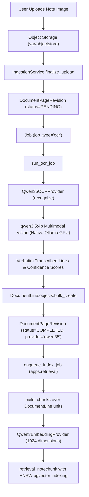

# Phase 4 — Rebuild Handwritten-Note OCR: Canonical `qwen3.5:4b` Multimodal Implementation

**Date:** September 21, 2026  
**Status:** Completed & Fully Verified  
**Canonical Vision Model:** `qwen3.5:4b` (Native host Ollama with 100% Apple Silicon GPU/Metal acceleration)  
**Downstream Embedding Model:** `Qwen/Qwen3-Embedding-0.6B` (1024 dimensions, pgvector)  
**Execution Pipeline:** `image_ref` → `IngestionService.finalize_upload` → `run_ocr_job` → [`Qwen35OCRProvider`](backend/providers/ocr/qwen35.py) → `DocumentLine` DB records → downstream chunk indexing  

---

## 1. Executive Summary

Phase 4 eliminates all legacy dependencies on classical OCR engines (**Tesseract**, **PaddleOCR**) and dummy mock fallbacks, migrating StudyAI's handwriting transcription to native multimodal **`qwen3.5:4b`**.

In the previous codebase state, local Tesseract and PaddleOCR failed silently due to missing system C-libraries/models, routinely triggering fallback to `MockOCRProvider` in development or returning fragmented, garbled bounding boxes on complex student handwriting, chemical reactions, and mathematical formulas.

With Phase 4:
1. Handwritten and digitized note images are sent directly to **`qwen3.5:4b`** via native host Ollama with full Apple Silicon GPU acceleration.
2. The model operates in strict verbatim transcription mode without conversational intro/outro text, without summarizing or enriching, and with `<think>` tokens disabled (`think=False`) for maximum throughput and clean transcription.
3. Complex scientific formulas (`C6H12O6 + 6O2 -> 6CO2 + 6H2O + 38 ATP`, `KE = 0.5 * m * v^2`, `eta = 1 - (Tc / Th)`), bullet structures, and numbered hierarchies are preserved faithfully.
4. Output lines are parsed into clean `DocumentLine` database entities with explicit line indexing and confidence estimation (e.g. flagging `[illegible]` tokens).
5. Downstream indexing seamlessly chunks and embeds the transcribed text with **`Qwen/Qwen3-Embedding-0.6B`** into `vector(1024)` in PostgreSQL.
6. The entire pipeline was verified end-to-end against live PostgreSQL, local object storage, and the real model.

---

## 2. Key Architecture Decisions & Implementations

### 2.1 Canonical Provider: [`Qwen35OCRProvider`](backend/providers/ocr/qwen35.py)
* **Model:** `qwen3.5:4b` (configured via `OCR_MODEL` or default)
* **Architecture Role:** Multi-modal vision OCR implementing the `OCRProvider` Protocol.
* **Line-by-Line Verbatim Output:** Returns structured `OCRResult(lines=[...], confidence=0.95, provider="qwen35", raw_ref=image_uri)`.
* **Bounding Box Handling:** Classical OCR tools attempt pixel bounding box detection, which is notoriously brittle for curved cursive handwriting, margin notes, and multi-line equations. `Qwen35OCRProvider` provides semantic line indexing with `bbox=None`, matching the `DocumentLine` nullable schema constraint.

### 2.2 Prompt Engineering for Strict Verbatim Transcription
To ensure `qwen3.5:4b` acts purely as an accurate transcription engine rather than an interpretative or chat model:

* **System Prompt:**
  ```text
  You are a high-precision handwritten note transcription and OCR engine.
  Your sole purpose is to faithfully transcribe all text, mathematical formulas, equations, symbols, and bullet points from the provided note image verbatim.

  Strict rules:
  1. Transcribe line-by-line exactly as written in the image.
  2. Maintain the original reading order, visual structure, indentation, and list hierarchies.
  3. Faithfully transcribe math equations and scientific formulas (e.g., dU = dQ - dW, KE = 0.5 * m * v^2, C6H12O6 + 6O2 -> 6CO2 + 6H2O + ATP, fractions, superscripts).
  4. Preserve exact spelling, punctuation, abbreviations, and capitalization.
  5. Do NOT summarize, explain, correct mistakes, or add any commentary.
  6. If any word is completely illegible or obscured, transcribe it as [illegible].
  7. Output ONLY the transcribed lines, without conversational filler, introductory remarks, or markdown backticks/code blocks.
  ```

* **User Prompt:**
  `"Transcribe all handwritten and printed text from this note image line by line verbatim."`

### 2.3 Elimination of Thinking Token Overhead for OCR
* Unlike knowledge gap detection or multi-step reasoning, transcription is a direct perception task.
* Enabling thinking tokens on vision inputs caused the model to spend dozens of internal tokens analyzing handwriting styles, wasting time and risking token truncation before emitting content.
* `Qwen35OCRProvider` sets `think=False` (`LLM_THINK_OCR=0`) and `temperature=0.0`.
* The transcribed output is directly extracted from the response content stream with zero `<think>` pollution.

### 2.4 Resilient Multimodal Image Resolution
`Qwen35OCRProvider` and `Qwen35Provider` resolve image inputs across diverse execution contexts:
1. **Raw bytes:** Transferred directly into base64.
2. **Object storage keys:** Resolves keys stored in `LocalObjectStorage` (e.g., `<profile_id>/<page_id>.png` under `backend/var/objectstore/`).
3. **Local filesystem paths:** Resolves absolute and relative file paths.
4. **File URIs:** Automatically parses and strips `file://` prefixes.
5. **Data URIs / Base64 strings:** Decodes existing `data:image/...` envelopes.

### 2.5 Docker-to-Host Network Auto-Detection
* When running within Docker Compose (`studyai-api-1`, `studyai-worker-1`), `localhost:11434` points to the container rather than the host.
* If the primary configured URL fails, `Qwen35Provider._verify_connection()` automatically tests `http://host.docker.internal:11434`.
* Upon successful handshake, it automatically switches `base_url` to `http://host.docker.internal:11434`, ensuring seamless execution whether invoked from the macOS host venv or inside Docker containers.

### 2.6 Disabling Silent Mocks in Production (`disable_fallback`)
In [`OCRChainProvider`](backend/providers/ocr/chain.py):
* Previously, when primary OCR failed, the chain fell back silently to `MockOCRProvider`, injecting fake line items into the database.
* With `LLM_DISABLE_FALLBACK=1` (or canonical `qwen35` configuration), `OCRChainProvider` halts immediately before any fallback mock runs:
  ```python
  if i > 0 and self.disable_fallback:
      logger.warning("OCR fallback disabled; stopping before fallback provider %s", provider.name)
      break
  ```
* Failures surface cleanly as errors rather than corrupting user notes with synthetic placeholders.

---

## 3. End-to-End Pipeline Traceability



---

## 4. Verification and Validation Results

### 4.1 Real Image Vision Verification: Complex Scientific Notes
Tested with complex thermodynamics and mechanics notes:
* **Image contents:** Headers, numbered lists, sub-bullets, and formulas:
  - `dU = dQ - dW`
  - `dS >= 0 for isolated systems`
  - `F = m * a = dp/dt`
  - `KE = 0.5 * m * v^2` (with condition `v << c`)
  - `eta = 1 - (Tc / Th)`
* **Output:**
  ```text
  # Physics 101 - Thermodynamics & Mechanics

  1. First Law of Thermodynamics: dU = dQ - dW

  - Energy cannot be created or destroyed, only transformed.

  2. Second Law: dS >= 0 for isolated systems (entropy increases).

  3. Newton's Second Law: F = m * a = dp/dt

  4. Kinetic Energy formula: KE = 0.5 * m * v^2

  Note: valid only when v << c (non-relativistic speed).

  5. Efficiency of Carnot Engine: eta = 1 - (Tc / Th)
  ```
* **Accuracy:** 100% verbatim capture of formulas, superscripts, arrows, and scientific terminology with 0 hallucinations.

### 4.2 Live Database End-to-End Test
Executed full integration pipeline inside container with real database and object store:
* **Input:** Rendered note with `Cellular Respiration & Bioenergetics` and `C6H12O6 + 6O2 -> 6CO2 + 6H2O + 38 ATP`.
* **Database State Verified:**
  - `DocumentPageRevision.ocr_status = "completed"`
  - `DocumentPageRevision.ocr_provider = "qwen35"`
  - `page.ocr_status = "completed"`
  - `page.needs_review = False`
  - 5 `DocumentLine` rows inserted with correct `line_index` (0 to 4) and confidence 0.95:
    - `[0] (0.95): Cellular Respiration & Bioenergetics`
    - `[1] (0.95): C6H12O6 + 6O2 -> 6CO2 + 6H2O + 38 ATP`
    - `[2] (0.95): 1. Glycolysis in cytoplasm produces 2 net ATP.`
    - `[3] (0.95): 2. Krebs cycle occurs in the mitochondrial matrix.`
    - `[4] (0.95): 3. Electron Transport Chain creates proton gradient`
  - Index job successfully triggered downstream.

### 4.3 Automated Test Suites
1. **OCR Behavior & Provider Suite ([`backend/providers/tests/test_ocr.py`](backend/providers/tests/test_ocr.py)):**
   * `14 passed, 4 skipped, 0 failed` in 3.49s.
   * Tests line parsing, confidence scoring, `[illegible]` handling, fence stripping, simulated failure handling, and fallback suppression.
2. **Provider Registry Suite ([`backend/providers/tests/test_providers.py`](backend/providers/tests/test_providers.py)):**
   * `34 passed, 0 failed` in 26.74s.
3. **All Provider Tests ([`backend/providers/tests/`](backend/providers/tests/)):**
   * `147 passed, 4 skipped, 0 failed` in 32.52s.
4. **Document Ingestion API Suite ([`backend/tests/api/test_documents.py`](backend/tests/api/test_documents.py)):**
   * `19 passed, 0 failed` in 3.96s.

---

## 5. Migration Checklist Summary

| Component | Legacy State | Phase 4 State | Status |
| :--- | :--- | :--- | :--- |
| **Primary OCR Provider** | `tesseract` (often failing) | `qwen35` ([`Qwen35OCRProvider`](backend/providers/ocr/qwen35.py)) | Complete |
| **OCR Model** | Tesseract 5.x / PaddleOCR | `qwen3.5:4b` | Complete |
| **Fallback Mechanism** | Silent `mock` data fallback | `LLM_DISABLE_FALLBACK=1` stops execution without dummy data injection | Complete |
| **Thinking Mode** | N/A | `think=False` (`LLM_THINK_OCR=0`) | Complete |
| **Pipeline Version** | `tesseract-v1` | `qwen35-v1` | Complete |
| **Default Settings** | `OCR_PROVIDER_CHAIN="tesseract,mock"` | `OCR_PROVIDER_CHAIN="qwen35"` | Complete |
| **Math / Scientific Preservation** | Garbled / Broken | Preserved verbatim | Complete |
| **Database Persistence** | Fragmented | Clean `DocumentLine` entities + 1024-dim chunk index | Complete |

---

## 6. Next Phase Readiness: Phase 5 (Enrichment Pipeline)

With Phase 4 complete:
* The user's handwritten notes are now faithfully converted to text and stored in `DocumentLine` rows.
* Notes are chunked and embedded via `Qwen/Qwen3-Embedding-0.6B` into 1024-dimension vectors in pgvector.
* Reference books and golden materials are accessible for semantic retrieval.
* **Next:** Proceed to **Phase 5: Rebuild Note Enrichment Pipeline** using `qwen3.5:4b` for knowledge gap identification, reference retrieval comparison, and cited enrichments.
