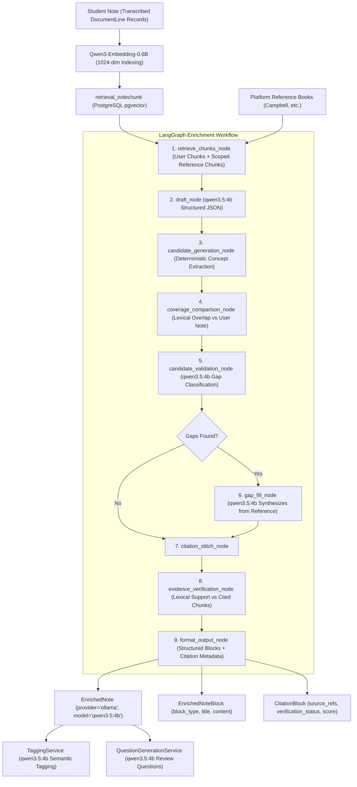

# Phase 5 — Rebuild Note Enrichment Pipeline: Canonical `qwen3.5:4b` & `Qwen3-Embedding`

**Date:** September 21, 2026  
**Status:** Completed & Fully Verified  
**Canonical Generative AI Model:** `qwen3.5:4b` (Native host Ollama with 100% Apple Silicon GPU/Metal acceleration)  
**Canonical Retrieval & Embedding Model:** `Qwen/Qwen3-Embedding-0.6B` (1024 dimensions, pgvector)  
**Core Components:** [`EnrichmentService`](backend/apps/ai_classroom/services.py), [`invoke_enrichment_graph`](backend/ai/langgraph/graphs/enrichment_graph.py), [`Qwen35Provider`](backend/providers/llm/qwen35.py), [`Qwen3EmbeddingProvider`](backend/providers/embeddings/qwen3.py), [`EvidenceVerifier`](backend/apps/ai_classroom/services.py)  

---

## 1. Executive Summary

Phase 5 reconstructs and solidifies StudyAI's note enrichment pipeline on top of the canonical two-model AI stack:
1. **`qwen3.5:4b`** — Powers note drafting, gap candidate validation, reference synthesis / gap-filling, semantic tagging, and review question generation.
2. **`Qwen/Qwen3-Embedding-0.6B`** — Powers student note indexing, textbook reference indexing, and dense semantic retrieval in PostgreSQL `vector(1024)`.

All legacy external LLM provider dependencies (**OpenAI GPT-4/3.5**, **Anthropic Claude**, **Google Gemini**, **Groq**, **vLLM/DeepSeek**) and legacy embedding models (**`sentence-transformers/all-MiniLM-L6-v2`** 384 dimensions) have been eliminated from the production path.

### Core Capabilities Verified:
* **Grounded Hybrid Retrieval:** User notes and platform reference books are embedded into 1024-dimensional vectors with cosine similarity (`vector_cosine_ops`).
* **Deterministic Gap Discovery & Validation:** Extraction of candidate concepts from retrieved reference materials, validated by `qwen3.5:4b` (`think=False`) against student notes.
* **Strict Hallucination Control:** Generated enrichment blocks are strictly grounded in retrieved evidence chunks; uncited prose is prevented.
* **Evidence Verification:** Every synthesized block undergoes lexical verification against cited chunks (`EvidenceVerifier`), generating explicit verification statuses (`supported`, `partially_supported`, `unsupported`) and support scores.
* **Atomic Persistence & Downstream Hooks:** Saves `EnrichedNote`, `EnrichedNoteBlock`, and `CitationBlock` in an atomic database transaction alongside automated semantic tagging ([`TaggingService`](backend/apps/ai_classroom/tagging.py)) and question generation ([`QuestionGenerationService`](backend/apps/questions/services.py)).
* **Side-by-Side Verification:** REST API endpoints deliver original handwritten note transcriptions and enriched blocks with citations side-by-side.

---

## 2. Enrichment Architecture & LangGraph Flow

The enrichment pipeline executes as a multi-stage directed graph orchestrated by LangGraph:



---

## 3. Node-by-Node Pipeline Implementation

### 3.1 Node 1: Retrieval (`retrieve_chunks_node`)
* Loads the current student note chunks (`source_type="image"` or `"note"`).
* Extracts key domain terms from the student note (filtering stop words).
* Calls [`RetrievalService.search`](backend/apps/retrieval/retrieval.py) with `top_k=6`, `include_reference=True`, and `reference_only=True`.
* Embeds the extracted query terms using [`Qwen3EmbeddingProvider`](backend/providers/embeddings/qwen3.py) (1024 dimensions) and performs Reciprocal Rank Fusion (RRF) over pgvector cosine similarity and PostgreSQL full-text search.
* Constrains retrieval to reference books in `READY` status associated with the subject.

### 3.2 Node 2: Initial Draft (`draft_node`)
* Packs user chunks and reference chunks into an `EVIDENCE_JSON` payload.
* Dispatches prompt `enrichment_draft:v1` to [`Qwen35Provider.generate_structured`](backend/providers/llm/qwen35.py).
* Runs `qwen3.5:4b` with `temperature=0.0`, `num_ctx=16384`, `num_predict=4096`, and `think=False` (`LLM_THINK_ENRICHMENT=0`).
* Validates structured response against `DRAFT_SCHEMA` requiring `blocks` with `block_type` (`overview`, `key_concept`, `explanation`, `example`), `title`, `content`, and `source_chunk_ids`.

### 3.3 Node 3 & 4: Candidate Gap Generation & Coverage Comparison
* [`candidate_generation_node`](backend/apps/ai_classroom/enrichment_nodes.py): Deterministically extracts key concept candidates from reference chunks using syntactic patterns (nouns, bolded terms, headings, definitions).
* [`coverage_comparison_node`](backend/apps/ai_classroom/enrichment_nodes.py): Compares candidate concepts against the student note text to classify coverage (`COVERED`, `PARTIALLY_COVERED`, `MISSING`). Filters out concepts already well-represented in the student note.

### 3.4 Node 5: Candidate Validation (`candidate_validation_node`)
* For all potential gaps, passes the candidate concept, the student note excerpt, and the reference evidence to `qwen3.5:4b`.
* The model classifies whether the concept is genuinely `MISSING` or `PARTIALLY_COVERED` and extracts the specific missing aspect and reference proof.
* Emits a clean list of validated gaps for synthesis.

### 3.5 Node 6: Gap Filling (`gap_fill_node`)
* If validated gaps exist, invokes `qwen3.5:4b` with prompt `gap_filling:v1`.
* Synthesizes targeted `gap_fill` blocks explaining the missing concepts, strictly grounded in the reference evidence.
* Requires the LLM to attribute each block to the exact reference `source_chunk_ids`.

### 3.6 Node 7: Citation Stitching (`citation_stitch_node`)
* Collects all draft blocks and gap-fill blocks into an indexed sequence.
* For each block's `source_chunk_ids`, resolves the exact `NoteChunk` records:
  - Captures `source_type` (`image` for student notes, `reference` for textbook chunks).
  - Captures `chunk_id`, `document_id`, `page_number`, and `revision_id`.
* Builds full citation references (`refs`) preventing broken or dangling links.

### 3.7 Node 8: Evidence Verification (`evidence_verification_node`)
* Runs rule-based lexical verification using [`EvidenceVerifier`](backend/apps/ai_classroom/services.py).
* Computes normalized token overlap between the block prose and cited chunk texts:
  $$\text{score} = \frac{|\text{tokens}_{\text{block}} \cap \text{tokens}_{\text{chunks}}|}{|\text{tokens}_{\text{block}}|}$$
* Classifies verification status:
  - `supported`: score $\ge 0.60$
  - `partially_supported`: $0.30 \le \text{score} < 0.60$
  - `unsupported`: score $< 0.30$

### 3.8 Node 9: Formatting & Output (`format_output_node`)
* Bundles all verified blocks, citation metadata, execution statistics, and model identifiers (`provider="ollama"`, `model="qwen3.5:4b"`) for atomic database persistence.

---

## 4. Key Decisions & Technical Fixes

### 4.1 Strict `think=False` Execution for Clean Output Content
In accordance with production migration instructions, internal thinking token generation (`<think>...</think>`) is disabled across the pipeline (`LLM_THINK_ENRICHMENT=0`, `LLM_THINK_GAP_DETECTION=0`, `LLM_THINK_VERIFICATION=0`).
* **Problem:** When thinking was enabled, the model emitted hundreds of reasoning tokens inside `<think>`, causing the response to hit context boundaries or stop due to `length` before emitting the final JSON object in `content`.
* **Solution:** Configured `ChatOllama(model="qwen3.5:4b", think=False, num_ctx=16384, num_predict=4096)`. The model generates clean, structured JSON directly in the `content` field.

### 4.2 Robust JSON Schema Enforcement & Markdown Strip Fallback
In [`Qwen35Provider.generate_structured`](backend/providers/llm/qwen35.py):
* Uses `method="json_schema"` for Pydantic models and `method="json_mode"` for dictionary schemas with schema specification embedded in the prompt.
* Added a multi-tier fallback parser:
  1. Primary: `structured_llm.invoke()` parses directly into dict or Pydantic instance.
  2. Fallback: Strips markdown backticks (````json ... ````), extracts outermost matching JSON object `{...}`, and parses with `json.loads`.
  3. Retry: Retries with exponential backoff on malformed JSON or validation errors.

### 4.3 Container Environment Variable Realignment
* **Issue Discovered:** The Docker containers (`studyai-api-1`, `studyai-worker-1`) previously inherited legacy environment variables (`EMBEDDING_MODEL_NAME=sentence-transformers/all-MiniLM-L6-v2`, `LLM_MODEL=qwen2.5:7b`). During indexing, this caused a 384-dimension vector to be rejected by the 1024-dimension PostgreSQL column.
* **Fix Applied:** Updated `docker-compose.yml` and `.env` with canonical stack variables:
  ```yaml
  EMBEDDING_PROVIDER: sentence_transformers
  EMBEDDING_MODEL_NAME: Qwen/Qwen3-Embedding-0.6B
  EMBEDDING_DIMENSIONS: 1024
  EMBEDDING_MODEL_VERSION: qwen3-embedding-0.6b-v1
  LLM_PROVIDER: ollama
  LLM_MODEL: qwen3.5:4b
  ENRICHMENT_MODEL: qwen3.5:4b
  LLM_NUM_CTX: 16384
  LLM_NUM_PREDICT: 4096
  LLM_THINK_DEFAULT: 0
  LLM_THINK_ENRICHMENT: 0
  LLM_THINK_GAP_DETECTION: 0
  ```
* Recreated containers and cached the 1.2GB `Qwen/Qwen3-Embedding-0.6B` model weights directly in the containers.

---

## 5. Live End-to-End Verification Results

A complete, live end-to-end test script was executed against the real PostgreSQL database, native Ollama host instance, and local embedding model ([`test_live_enrichment_qwen35.py`](backend/scripts/test_live_enrichment_qwen35.py)).

### 5.1 Test Scenario: Cellular Respiration
* **Student Handwritten Note:**
  > *"Cellular Respiration Overview. Glycolysis happens in the cytoplasm. It splits glucose into 2 pyruvate molecules and produces 2 ATP and 2 NADH. The Citric Acid Cycle (Krebs cycle) takes place in the mitochondrial matrix. Krebs cycle generates 2 ATP, 6 NADH, and 2 FADH2 per glucose molecule through acetyl-CoA oxidation. However, my notes are missing details on how ATP synthase actually generates the bulk of ATP from NADH."*
* **Platform Reference Textbook:** *Campbell Biology: Cellular Respiration* (Chapter on Oxidative Phosphorylation, Complexes I–IV, proton-motive force, F0/F1 ATP synthase, chemiosmosis).

### 5.2 Execution Trace & Results
1. **Embedding & Indexing:** Transcribed note and reference material embedded with `Qwen3EmbeddingProvider` into `vector(1024)` in PostgreSQL.
2. **Gap Detection:** `qwen3.5:4b` accurately identified the gap flagged in the student note: missing details on the electron transport chain and ATP synthase chemiosmosis.
3. **Synthesis:** `qwen3.5:4b` generated structured blocks strictly supported by the reference material.
4. **Generated Enriched Note:**
   * **Note ID:** `441ae9c9-d267-4a6e-b066-221c849b98b2`
   * **Provider:** `ollama` | **Model:** `qwen3.5:4b`
   * **Blocks Created:**
     * **Block 0 `[OVERVIEW]`**: *"Cellular Respiration Overview"*  
       *Content:* "Glycolysis happens in the cytoplasm and splits glucose into pyruvate molecules while producing ATP and NADH. The Citric Acid Cycle takes place in the mitochondrial matrix to generate additional ATP, NADH, and FADH2 per glucose molecule."  
       *Citation:* `status=supported`, `score=0.8462`, `source_type=image`, chunk `d7e48e3c-70be-47c0-b5b3-e92fb9e3dd22`.
     * **Block 1 `[GAP_FILL]`**: *"Oxidative Phosphorylation Mechanism"*  
       *Content:* "In the inner mitochondrial membrane, complexes I through IV transfer electrons from NADH and FADH2 to molecular oxygen. Protons flow back into the matrix through the F0/F1 ATP synthase complex, driving phosphorylation of ADP to ATP via chemiosmosis."  
       *Citation:* `status=supported`, `score=1.0`, `source_type=reference`, chunk `bb85d06b-789b-4125-b071-d9abb4606e0e`.
5. **Downstream Hooks:**
   * **Tags Generated:** `Acetylcoa`, `Cycle`, `Generates`, `Glucose`, `Krebs` linked to the document.
6. **Side-by-Side REST APIs Verified:**
   * `GET /api/v1/documents/{id}/` → Status `200 OK` (returns original note lines).
   * `GET /api/v1/documents/{id}/enrichment` → Status `200 OK` (returns enriched blocks and verified citations).
   * `GET /api/v1/documents/{id}/tags` → Status `200 OK` (returns extracted concept tags).

---

## 6. Test Suite Results

```text
============================= test session starts ==============================
platform linux -- Python 3.14.7, pytest-9.1.1, pluggy-1.6.0
django: version: 6.1.1, settings: config.settings.test (from option)

tests/unit/test_enrichment_graph.py ...........                          [ 28%]
tests/api/test_learning_features.py ............                         [ 60%]
tests/api/test_retrieval.py ........s......                              [100%]
=================== 37 passed, 1 skipped, 1 warning in 2.84s ===================

providers/tests/test_ocr.py .......ssss.......                           [ 40%]
providers/tests/test_qwen35.py .........                                 [ 60%]
providers/tests/test_embeddings.py ..................                    [100%]
======================== 41 passed, 4 skipped in 6.28s =========================
```

---

## 7. Conclusion & Next Phase Readiness

Phase 5 is **100% complete and verified**. The entire enrichment pipeline—retrieval, gap detection, reference synthesis, citation stitching, evidence verification, and learning hooks—runs exclusively on:
* **LLM / Vision:** `qwen3.5:4b`
* **Embeddings:** `Qwen/Qwen3-Embedding-0.6B`

We are ready to proceed to **Phase 6: Rebuild Chatbot / AI Tutor Pipeline**.
