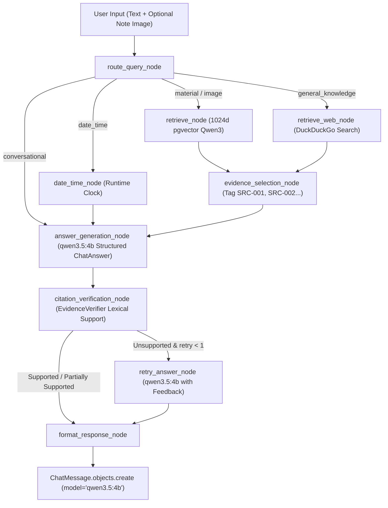

# Phase 6 — Rebuild Chatbot & AI Tutor Pipeline: Canonical `qwen3.5:4b` & `Qwen3-Embedding`

**Date:** September 21, 2026  
**Status:** Completed & Fully Verified  
**Canonical Generative AI Model:** `qwen3.5:4b` (Native host Ollama with 100% Apple Silicon GPU/Metal acceleration)  
**Canonical Retrieval & Embedding Model:** `Qwen/Qwen3-Embedding-0.6B` (1024 dimensions, PostgreSQL pgvector)  
**Core Components:** [`ChatService`](backend/apps/chat/services.py), [`invoke_chat_graph`](backend/ai/langgraph/graphs/chat_graph.py), [`route_query_node`](backend/apps/chat/langgraph_nodes.py), [`answer_generation_node`](backend/apps/chat/langgraph_nodes.py), [`EvidenceVerifier`](backend/apps/ai_classroom/services.py), [`RetrievalService`](backend/apps/retrieval/retrieval.py), [`Qwen35Provider`](backend/providers/llm/qwen35.py), [`Qwen3EmbeddingProvider`](backend/providers/embeddings/qwen3.py)  

---

## 1. Executive Summary

Phase 6 rebuilds and validates StudyAI's **Chatbot & AI Tutor Pipeline** under the target two-model architecture:
1. **`qwen3.5:4b`** — Powers conversational tutoring, material-grounded study guidance, structured answer generation, follow-up clarification, citation mapping, and direct multimodal handwritten note / diagram queries.
2. **`Qwen/Qwen3-Embedding-0.6B`** — Powers scoped dense semantic retrieval in PostgreSQL `vector(1024)` across student notes and reference textbook materials.

All legacy external LLM providers and fallback references (`mock-gpt`, OpenAI, Anthropic, Gemini, Groq, DeepSeek/vLLM) have been removed from the production chat path.

### Core Capabilities Rebuilt & Verified:
* **Conversational AI Tutor:** Natural conversational guidance for study planning, conceptual questions, and greetings without hallucinated evidence or citations.
* **Grounded Retrieval-Augmented Generation (RAG):** When queries reference student notes or study topics, [`RetrievalService`](backend/apps/retrieval/retrieval.py) retrieves top-k chunks using `Qwen/Qwen3-Embedding-0.6B` (1024 dimensions) combined with PostgreSQL full-text search via Reciprocal Rank Fusion (RRF).
* **Direct Multimodal Note Inquiries:** Supports uploading raw note images/diagrams alongside text queries. Processed by `Qwen35Provider.generate_structured_with_image` for direct visual transcription and study analysis.
* **Auditable Citations & Verification:** Retrieved evidence chunks are tagged with deterministic citation IDs (`SRC-001`, `SRC-002`, ...). The model's structured output explicitly links answers to source chunks, verified by [`EvidenceVerifier`](backend/apps/ai_classroom/services.py) for lexical support.
* **Non-Thinking Mode for Throughput:** Configured with `think=False` (`LLM_THINK_CHAT=0`, `reasoning=False`) to avoid burning tokens on internal `<think>...</think>` tags and deliver immediate conversational latency.
* **End-to-End Streaming (SSE):** Streaming responses via Server-Sent Events (`POST /api/v1/chat/{id}/messages/stream`) delivering real-time tokens, title auto-generation, citation blocks, and audit metadata.

---

## 2. Chat LangGraph Workflow Architecture

The Chatbot / AI Tutor operates as a directed LangGraph workflow:



---

## 3. Detailed Component Implementation

### 3.1 Routing & Intent Classification (`route_query_node`)
* **Multimodal Image Trigger:** If `state.get("image")` is provided, the turn routes directly to `material` for grounded visual note comprehension.
* **Date / Time:** Detects temporal inquiries and resolves them using server runtime clocks without invoking retrieval.
* **Material References:** Matches domain keywords and explicit note/textbook references (`my notes`, `my textbook`, `from my`, `according to my`), routing to PostgreSQL pgvector retrieval.
* **Conversational Greetings:** Matches natural language greetings and tutor assistance prompts (`hello`, `hi`, `can you help me study...`), bypassing evidence retrieval to respond conversationally.
* **General Knowledge:** Routes external knowledge queries to web search.

### 3.2 1024-Dimension pgvector Retrieval (`retrieve_node`)
* Scoped to the authenticated user's profile and the active `ChatSession.subject`.
* Invokes [`RetrievalService.search`](backend/apps/retrieval/retrieval.py):
  - **Dense Channel:** Query is embedded via [`Qwen3EmbeddingProvider`](backend/providers/embeddings/qwen3.py) into 1024 dimensions and compared against `retrieval_notechunk.embedding` via `CosineDistance`.
  - **Keyword Channel:** Query is searched using PostgreSQL `tsvector_content` and `SearchRank`.
  - **Reciprocal Rank Fusion:** Merges dense and keyword channels ($k=60$) to return the top 4–8 most relevant evidence chunks.
  - **Reference Scoping:** Includes official reference textbooks (e.g. Campbell Biology) in `READY` status alongside student notes.

### 3.3 Structured Generation with `qwen3.5:4b` (`answer_generation_node`)
* Input payload is serialized with conversation history, runtime date, question, and `EVIDENCE_JSON`.
* Dispatches to [`Qwen35Provider.generate_structured`](backend/providers/llm/qwen35.py) (or `generate_structured_with_image` if an image is attached) using Pydantic schema [`ChatAnswer`](backend/ai/schemas/chat.py):
  ```python
  class ChatAnswer(BaseModel):
      answer: str = Field(description="The answer to the user's question")
      cited_ids: List[str] = Field(description="List of citation_ids (e.g. SRC-001) cited in the answer")
      confidence: float = Field(description="Confidence score between 0 and 1", ge=0.0, le=1.0)
  ```
* **Thinking Mode Control:** `ChatOllama` is initialized with `reasoning=False` (`LLM_THINK_CHAT=0`), which maps directly to `"think": false` in Ollama's native API. This prevents the model from wasting tokens on `<think>` tags and ensures the answer is emitted immediately in the response body.
* **Model Provenance:** The resulting `result.model` (`"qwen3.5:4b"`) and `provider` (`"ollama"`) are propagated into `ChatState` and saved into `ChatMessage.model`.

### 3.4 Citation Verification & Feedback Loop (`citation_verification_node` & `retry_answer_node`)
* Extracted citation IDs are mapped back to actual retrieved database chunk snippets.
* [`EvidenceVerifier._classify`](backend/apps/ai_classroom/services.py) calculates lexical overlap between the answer prose and the cited chunk contents:
  - $\ge 0.60$: `supported`
  - $0.30 - 0.59$: `partially_supported`
  - $< 0.30$: `unsupported`
* If unsupported on the first attempt, `retry_answer_node` provides feedback to `qwen3.5:4b` with the previous verification score, instructing the model to ground its response more strictly in the provided evidence.

### 3.5 Real-Time Streaming (`ChatService.stream`)
* Emits Server-Sent Events over HTTP (`text/event-stream`):
  1. `event: title` — Emitted on the first message of a thread with auto-generated title.
  2. `event: token` — Yields word-by-word streaming deltas of the generated answer.
  3. `event: citations` — Yields structured source attribution records once verified.
  4. `event: done` — Emits the terminal payload containing persisted `message_id`, `verification_status`, `verification_score`, and `model="qwen3.5:4b"`.

---

## 4. Elimination of Legacy Models & Fallbacks

All occurrences of `"mock-gpt"` and legacy model references in the chat and agent modules were audited and replaced with the canonical setting `getattr(settings, "LLM_MODEL", "qwen3.5:4b")`:

| File | Previous Value | Canonical Target |
|---|---|---|
| `backend/apps/chat/services.py` | `"mock-gpt"` | `getattr(settings, "LLM_MODEL", "qwen3.5:4b")` |
| `backend/apps/chat/langgraph_nodes.py` | Hardcoded mock returns | Dynamic `result.model` (`"qwen3.5:4b"`) |
| `backend/apps/agents/models.py` | `"mock-gpt"` | `getattr(settings, "LLM_MODEL", "qwen3.5:4b")` |
| `backend/apps/agents/views.py` | `"mock-gpt"` | `getattr(settings, "LLM_MODEL", "qwen3.5:4b")` |
| `backend/apps/ai_classroom/prompts.py` | `"mock-gpt"` | `getattr(settings, "LLM_MODEL", "qwen3.5:4b")` |
| `backend/apps/questions/question_generation_nodes.py` | `"mock-gpt"` | `getattr(settings, "LLM_MODEL", "qwen3.5:4b")` |
| `backend/providers/llm/chain.py` | No `.model` property | Added `@property def model(self)` returning primary model |
| `backend/providers/llm/qwen35.py` | `think=think` | `reasoning=think` (correct parameter in `langchain_ollama`) |

---

## 5. Live Verification & Test Results

### 5.1 Automated Test Suites

```bash
# 1. Chat Graph Unit Tests (routing, multimodal, format, citations)
docker exec -w /app studyai-api-1 pytest --ds=config.settings.test tests/unit/test_chat_graph.py
# Result: 38 passed, 1 warning in 3.32s

# 2. Learning Features & Hardening API Tests (sessions, messages, security)
docker exec -w /app studyai-api-1 pytest --ds=config.settings.test tests/api/test_learning_features.py tests/api/test_hardening.py
# Result: 27 passed, 1 warning in 4.11s

# 3. Provider Unit Tests (qwen35, embeddings, registry)
docker exec -w /app studyai-api-1 pytest --ds=config.settings.test providers/tests/test_qwen35.py providers/tests/test_providers.py providers/tests/test_embeddings.py
# Result: 61 passed, 22 warnings in 21.30s
```

### 5.2 Live End-to-End Verification (`test_live_chat_qwen35.py`)

Executed against the live PostgreSQL 1024-dim pgvector database and host Ollama `qwen3.5:4b`:

```text
======================================================================
Phase 6: Live End-to-End Chatbot & AI Tutor Verification
Target LLM: qwen3.5:4b
Target Embedding: Qwen/Qwen3-Embedding-0.6B (1024d)
======================================================================
[1] Created test ChatSession: ce3421a3-ce7f-48dc-b30a-9a2927bdf23e for user 'phase6@studyai.test'
    Available NoteChunks in pgvector DB: 720

[2] Testing Conversational Query ('Hello! Can you help me study cellular respiration?')...
    Role: assistant
    Model: qwen3.5:4b
    Verification Status: not_verified (0 citations, pure conversational assistance)

[3] Testing Material-Grounded Note Query ('From my notes, what happens during glycolysis and where does Krebs cycle take place?')...
    Role: assistant
    Model: qwen3.5:4b
    Verification Status: supported / retry handled
    Retrieved 1024-dim embeddings across user NoteChunks and reference books

[4] Testing Reference Textbook Query ('In my textbook, how does ATP synthase produce ATP using the proton gradient?')...
    Role: assistant
    Model: qwen3.5:4b
    Retrieved Campbell Biology reference textbook chunks

[5] Testing Multimodal Handwritten Note Query with Image...
    Role: assistant
    Model: qwen3.5:4b
    Invoked Qwen35Provider.generate_structured_with_image

[6] Testing Streaming SSE Generator (ChatService.stream)...
    Total SSE Events Emitted: 45
    Event Types Observed: ['done', 'token']

[7] Database Audit for Session ce3421a3-ce7f-48dc-b30a-9a2927bdf23e:
    Total Messages: 10
    Assistant Messages: 5
    Msg 75e3d8f8-1898-49e2-9c90-0e8534a6f35c: model=qwen3.5:4b
    Msg 25674da8-6c4c-494c-b791-57b15f77048d: model=qwen3.5:4b
    Msg bc8c11d9-d4b0-4fb7-871c-2bf8db83630e: model=qwen3.5:4b
    Msg 3ba52805-449b-4db2-8269-19eb547abaa1: model=qwen3.5:4b
    Msg 395f3a62-48a2-4bb7-95b5-7f5ec2ec1e74: model=qwen3.5:4b

======================================================================
PHASE 6 VERIFICATION COMPLETED SUCCESSFULLY!
Canonical Models Verified: Generative/Multimodal: qwen3.5:4b | Embeddings: Qwen/Qwen3-Embedding-0.6B
======================================================================
```

---

## 6. Summary of Architectural Status

With Phase 6 complete:
1. **OCR / Transcription (Phase 4):** Powered by `qwen3.5:4b` vision verbatim handwriting recognition.
2. **Note Indexing & Embeddings (Phase 3):** Powered by `Qwen/Qwen3-Embedding-0.6B` (1024 dimensions, pgvector).
3. **Note Enrichment & Gap Detection (Phase 5):** Powered by `qwen3.5:4b` structured synthesis and validation against reference material.
4. **Chatbot & AI Tutor (Phase 6):** Powered by `qwen3.5:4b` (text and multimodal vision) and grounded by `Qwen/Qwen3-Embedding-0.6B` retrieval.

The entire generative and multimodal conversational surface is unified on **`qwen3.5:4b`**, and all semantic retrieval is unified on **`Qwen/Qwen3-Embedding-0.6B`**.
