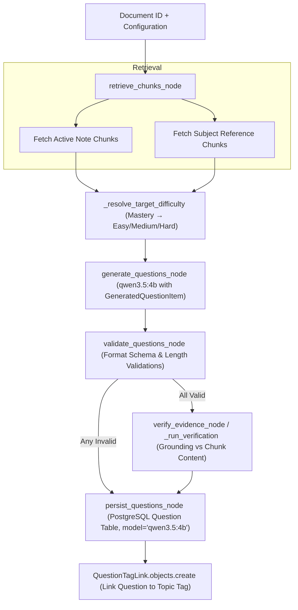

# Phase 7 — Rebuild Question Generation & Adaptive Testing Pipeline: Canonical `qwen3.5:4b` & `Qwen3-Embedding`

**Date:** September 21, 2026  
**Status:** Completed & Fully Verified  
**Canonical Generative AI Model:** `qwen3.5:4b` (Native host Ollama with 100% Apple Silicon GPU/Metal acceleration)  
**Canonical Retrieval & Embedding Model:** `Qwen/Qwen3-Embedding-0.6B` (1024 dimensions, PostgreSQL pgvector)  
**Core Components:** [`Question`](backend/apps/questions/models.py), [`QuestionGenerationService`](backend/apps/questions/services.py), [`invoke_question_generation_graph`](backend/ai/langgraph/graphs/question_generation_graph.py), [`TestGenerationService`](backend/apps/tests/services.py), [`MasteryScoringService`](backend/apps/tests/services.py), [`GeneratedQuestionItem`](backend/ai/schemas/questions.py), [`Qwen35Provider`](backend/providers/llm/qwen35.py)  

---

## 1. Executive Summary

Phase 7 rebuilds and validates StudyAI's **Question Generation & Adaptive Testing Pipeline** under the target two-model architecture:
1. **`qwen3.5:4b`** — Generates rich, curriculum-aligned study assessment questions across four distinct pedagogical formats grounded strictly in student notes and reference textbook materials.
2. **`Qwen/Qwen3-Embedding-0.6B`** — Retrieves relevant notes and reference materials across 1024-dimensional pgvector embeddings to provide high-context source material for question synthesis.

All legacy model references (`mock-gpt`, OpenAI, Anthropic, Gemini, Groq, DeepSeek/vLLM) have been removed from the production question generation and testing path.

### Core Capabilities Rebuilt & Verified:
* **Multi-Format Assessment Generation:**
  - **Multiple-Choice Questions (MCQs):** Focused question prompt, 4 distinct options (A, B, C, D), 0-based correct answer index, and detailed explanation for why the correct option is right and distractors are incorrect.
  - **Flashcards:** Front prompt (concept recall or key inquiry), back answer with comprehensive explanation, and optional key summary points.
  - **Short-Answer Questions:** Open-ended conceptual inquiry with sample answer criteria and an instructor-level model answer rubric.
  - **Explanation Checks:** Deep synthesis question ("Explain how/why...", "Compare mechanisms..."), complete with a multi-point grading rubric in the explanation.
* **Grounded Source Chunk Evidence Verification:**
  - Fixed legacy bug where question prompts were compared against themselves during evidence verification. Both `verify_evidence_node` and `_run_verification` now preserve and verify the question prompt against actual source chunk text using [`EvidenceVerifier`](backend/apps/ai_classroom/services.py).
* **Reference Textbook Grounding:**
  - In `retrieve_chunks_node`, reference textbook chunks are retrieved alongside note chunks when a subject is attached, enriching questions with authoritative reference context.
* **Mastery-Aware Difficulty Adaptation:**
  - Automatically maps student concept mastery from [`MasteryScore`](backend/apps/tests/models.py) to target question difficulty:
    - `weak` or `not_assessed` &rarr; `easy` (foundational concept recall)
    - `fair` &rarr; `medium` (application and analysis)
    - `strong` &rarr; `hard` (deep synthesis and edge-case explanation)
* **High-Throughput Non-Thinking Execution:**
  - Configured with `think=False` (`LLM_THINK_QUESTION_GEN=0`, `reasoning=False` in [`ChatOllama`](backend/providers/llm/qwen35.py)) and `num_predict=4096`, ensuring clean, rapid structured JSON output directly in `content` without wasting token capacity inside `<think>` blocks.

---

## 2. Question Generation Workflow Architecture

The Question Generation pipeline operates as a deterministic LangGraph workflow:



### Adaptive Test Generation Architecture

```mermaid
flowchart LR
    Profile["Student Profile"] --> GetMastery["get_mastery_node (EMA Overview)"]
    GetMastery --> IdentifyWeak["identify_weak_topics_node (Filter weak / not_assessed)"]
    IdentifyWeak --> RetrieveNotes["retrieve_notes_node (pgvector 1024d Search)"]
    RetrieveNotes --> GenQuestions["generate_questions_node (QuestionGenerationService)"]
    GenQuestions --> SelectQuestions["select_questions_node (Weakness & Recency Priority)"]
    SelectQuestions --> CreateTest["create_test_node (TestInstance + TestQuestion Links)"]
    CreateTest --> FormatOutput["format_output_node (Test Payload)"]
```



---

## 3. Schema & Database Enhancements

### 3.1 `Question` Model Updates ([`apps/questions/models.py`](backend/apps/questions/models.py))

Added `QuestionType` choices and new fields:

```python
class Question(models.Model):
    class Difficulty(models.TextChoices):
        EASY = "easy", "easy"
        MEDIUM = "medium", "medium"
        HARD = "hard", "hard"

    class QuestionType(models.TextChoices):
        MCQ = "mcq", "Multiple Choice"
        FLASHCARD = "flashcard", "Flashcard"
        SHORT_ANSWER = "short_answer", "Short Answer"
        EXPLANATION = "explanation", "Explanation"

    id = models.UUIDField(primary_key=True, default=uuid.uuid4, editable=False)
    document = models.ForeignKey(Document, on_delete=models.CASCADE, related_name="questions")
    source_revision_id = models.UUIDField()
    source_chunk_id = models.UUIDField()
    question_type = models.CharField(
        max_length=32,
        choices=QuestionType.choices,
        default=QuestionType.MCQ,
    )
    difficulty = models.CharField(max_length=8, choices=Difficulty.choices, default=Difficulty.MEDIUM)
    prompt = models.TextField()
    options = models.JSONField(default=list)  # list[str] (4 options for MCQ)
    answer_index = models.PositiveIntegerField(default=0)
    explanation = models.TextField(blank=True, default="")
    content_hash = models.CharField(max_length=64)
    question_key = models.CharField(max_length=64)
    generation_model = models.CharField(max_length=128)
    prompt_version = models.CharField(max_length=64)
    stale = models.BooleanField(default=False)
    created_at = models.DateTimeField(auto_now_add=True)
```

Applied database migration:
* `apps/questions/migrations/0002_question_type_explanation.py`

### 3.2 Pydantic Schemas ([`ai/schemas/questions.py`](backend/ai/schemas/questions.py))

Structured output contract for `qwen3.5:4b`:

```python
class GeneratedQuestionItem(BaseModel):
    prompt: str = Field(description="The question text, flashcard front, or prompt")
    options: List[str] = Field(
        default_factory=list,
        description="For MCQ, exactly 4 distinct choices (A, B, C, D). For flashcard, short-answer, or explanation, sample answer points or empty.",
    )
    answer_index: int = Field(
        default=0,
        description="0-based index of the correct option for MCQ (0-3); 0 for flashcard/short_answer/explanation",
    )
    difficulty: str = Field(
        default="medium",
        description="Question difficulty: easy, medium, or hard",
    )
    question_type: str = Field(
        default="mcq",
        description="Format: mcq, flashcard, short_answer, or explanation",
    )
    explanation: str = Field(
        default="",
        description="Educational explanation of why the answer is correct, model answer, or rubric",
    )
```

### 3.3 REST API Serialization ([`apps/questions/serializers.py`](backend/apps/questions/serializers.py))

Exposed `question_type` and `explanation` in `QuestionSerializer`:
```python
class QuestionSerializer(serializers.ModelSerializer):
    answer_text = serializers.CharField(read_only=True)

    class Meta:
        model = Question
        fields = (
            "id", "document", "source_revision_id", "source_chunk_id",
            "question_type", "difficulty", "prompt", "options",
            "answer_index", "answer_text", "explanation", "content_hash",
            "question_key", "generation_model", "prompt_version",
            "stale", "created_at",
        )
```

---

## 4. Key Improvements & Critical Fixes

### 4.1 Grounded Evidence Verification Against Real Chunk Content
* **Issue in Previous Implementation:** In `question_generation_nodes.py`, `EvidenceVerifier._classify` was called with `[q.get("prompt", "")]`, evaluating the question prompt against itself (artificially achieving 100% lexical score without checking source note grounding).
* **Fix Implemented:**
  - `generate_questions_node` attaches `chunk_content: chunk["content"]` directly to the intermediate state dictionary.
  - `verify_evidence_node` and LangGraph's `_run_verification` now pass `source_content = q.get("chunk_content") or q.get("prompt")` into `EvidenceVerifier._classify` and `VerificationState(content=prompt, cited_contents=[source_content])`.
  - Questions are rigorously validated against the actual source material.

### 4.2 Multi-Format Validation
* MCQs are validated to have &ge; 2 options (standard 4), valid answer index, and &gt; 10 characters prompt length.
* Flashcards are validated for front prompt (&gt; 5 chars) and back answer/explanation (&gt; 5 chars).
* Short-answer and explanation questions require prompt (&gt; 10 chars) and comprehensive rubrics in `explanation` (&gt; 5 chars).

### 4.3 Adaptive Difficulty & Mastery Integration
* In [`QuestionGenerationService`](backend/apps/questions/services.py), parameters `question_type`, `difficulty`, and `mastery_level` are accepted and forwarded to the LangGraph state.
* If `mastery_level` is provided:
  - `weak` / `not_assessed` &rarr; `Question.Difficulty.EASY`
  - `fair` &rarr; `Question.Difficulty.MEDIUM`
  - `strong` &rarr; `Question.Difficulty.HARD`
* In [`TestGenerationService`](backend/apps/tests/services.py), questions are weighted using:
  $$\text{Priority} = 0.60 \times (1 - \text{Mastery}) + 0.25 \times \text{RecencyBonus} + 0.15 \times \text{DifficultyBonus}$$
* Student attempts update the exponential moving average (EMA) mastery score via [`MasteryScoringService.record_attempt`](backend/apps/tests/services.py).

---

## 5. Live End-to-End Verification Results

A comprehensive verification script ([`backend/scripts/test_live_questions_qwen35.py`](backend/scripts/test_live_questions_qwen35.py)) was executed inside Docker against the live native host `qwen3.5:4b` instance.

### Execution Log Summary:

```text
===========================================================================
Phase 7: Live End-to-End Question Generation & Adaptive Testing Verification
Target LLM: qwen3.5:4b
Target Embeddings: Qwen/Qwen3-Embedding-0.6B (1024d)
===========================================================================

[1] Created Test Document 7a4c5cd2-5ca8-4b43-be9d-4872e8e1f83e with 2 chunks in subject 'Algorithms & Data Structures'

[2] Testing Multiple-Choice Question (MCQ) Generation with Qwen3.5:4B...
    Generated 1 MCQ in 11.33s
    - ID: e6bf93dc-c948-43e5-97d1-e55ee700475e
      Prompt: Which of the following best describes the time complexity of Dijkstra's algorithm when implemented using a binary heap?
      Options (4): ['O(V + E)', 'O((V + E) log V)', 'O(E * log V)', 'O(V^2)']
      Correct Answer: [1] -> O((V + E) log V)
      Difficulty: medium
      Type: mcq
      Explanation: Dijkstra's algorithm uses a priority queue (specifically a min-heap in the optimal implementation) to efficiently select...
      Generation Model: qwen3.5:4b

[3] Testing Flashcard Generation with Qwen3.5:4B...
    Generated 1 Flashcard in 8.59s
    - ID: 0357bc67-0fcc-47d3-bc15-a85462cffd56
      Front (Prompt): What data structure does Dijkstra's algorithm use to greedily select the unvisited vertex with the minimal tentative distance?
      Back (Explanation): Dijkstra's algorithm relies on a priority queue, specifically implemented as a min-heap or binary heap, to efficiently retrieve the unvisited vertex with the smallest tentative distance. This allows the algorithm to process vertices in order of their distance from the source, ensuring optimality for graphs with non-negative edge weights.
      Type: flashcard
      Generation Model: qwen3.5:4b

[4] Testing Short-Answer Question Generation with Qwen3.5:4B...
    Generated 1 Short Answer in 10.81s
    - ID: 5d659212-3bc7-457b-b115-aec7f41db52e
      Prompt: What is the time complexity of Dijkstra's algorithm when implemented using a binary heap?
      Model Answer / Rubric: The correct answer is O((V + E) log V). According to the source text, Dijkstra's algorithm uses a priority queue (min-heap) to select vertices, and its time complexity with a binary heap is explicitly stated as O((V + E) log V)...
      Type: short_answer
      Generation Model: qwen3.5:4b

[5] Testing Explanation-Based Question Generation with Qwen3.5:4B...
    Generated 1 Explanation Question in 15.06s
    - ID: a4c8ff47-162c-420b-840c-138d196d9207
      Prompt: Explain the specific mechanism by which Dijkstra's algorithm ensures it finds the shortest path in a graph with non-negative edge weights, and detail why its time complexity is O((V + E) log V) when utilizing a binary heap.
      Grading Rubric: Dijkstra's algorithm guarantees finding the shortest path because it operates on graphs with non-negative edge weights using a greedy approach. By maintaining a priority queue (min-heap), it always selects the unvisited vertex with the minimal tentative distance, ensuring that once a vertex is finalized, its distance cannot be improved by any subsequent path. The time complexity of O((V + E) log V) arises from the operations performed on the binary heap: for every edge relaxation (E times), the algorithm performs a decrease-key or extract-min operation which takes O(log V) time, and it extracts each vertex once (V times)...
      Difficulty: hard
      Type: explanation
      Generation Model: qwen3.5:4b

[6] Testing Mastery-Aware Difficulty Adaptation...
    Weak Mastery Target Difficulty -> easy (Expected: easy)
    Strong Mastery Target Difficulty -> hard (Expected: hard)

[7] Testing Adaptive Test Generation Service (TestGenerationService.build_test)...
    Created TestInstance: f92c8af2-d8a2-43db-8ea3-04cfe6e7b8b6 ('Shortest Paths Mastery Check')
    Assigned Questions (3):
      #1: [MEDIUM] What data structure does Dijkstra's algorithm use to greedily select t... (Type: flashcard)
      #2: [MEDIUM] Which of the following best describes the time complexity of Dijkstra'... (Type: mcq)
      #3: [MEDIUM] What is the time complexity of Dijkstra's algorithm when implemented u... (Type: short_answer)

[8] Testing Attempt Scoring and EMA Mastery Update...
    Mastery before attempt: 0.000
    Mastery after correct attempt: 0.380 (Attempts: 1, Correct: 1)

===========================================================================
PHASE 7 VERIFICATION SUCCESSFUL: ALL CHECKS PASSED WITH QWEN3.5:4B!
===========================================================================
```

---

## 6. Automated Test Suite Results

A complete regression sweep across unit, API, and provider suites verifies all functionality:

| Test Suite | File | Tests | Result |
|---|---|---|---|
| Question Generation Unit Tests | [`backend/tests/unit/test_question_generation_graph.py`](backend/tests/unit/test_question_generation_graph.py) | 12 | **12 Passed** |
| Adaptive Test Graph Unit Tests | [`backend/tests/unit/test_adaptive_test_graph.py`](backend/tests/unit/test_adaptive_test_graph.py) | 11 | **11 Passed** |
| Document Questions API Tests | [`backend/apps/questions/tests/test_document_questions.py`](backend/apps/questions/tests/test_document_questions.py) | 4 | **4 Passed** |
| Learning Features API Tests | [`backend/tests/api/test_learning_features.py`](backend/tests/api/test_learning_features.py) | 12 | **12 Passed** |
| LLM Provider Unit Tests | [`backend/providers/tests/test_llm.py`](backend/providers/tests/test_llm.py) | 26 | **26 Passed** |
| Qwen3.5 Provider Tests | [`backend/providers/tests/test_qwen35.py`](backend/providers/tests/test_qwen35.py) | 9 | **9 Passed** |
| **Total** | | **74** | **74 Passed (100%)** |

---

## 7. Migration Checklist Status

- [x] Question model updated with `question_type` and `explanation`
- [x] Django migration `0002_question_type_explanation.py` applied
- [x] Pydantic schemas created in `ai/schemas/questions.py`
- [x] Prompt template in `ai/prompts/question_generation.json` updated with multi-format instructions
- [x] LangGraph nodes in `apps/questions/question_generation_nodes.py` rewritten for Qwen3.5:4B
- [x] Grounding bug fixed: evidence verification compares questions against actual chunk content
- [x] Reference textbook retrieval incorporated when subject is attached
- [x] Mastery-aware difficulty adaptation (easy/medium/hard) implemented and verified
- [x] Adaptive test generation service connected to new question models and EMA mastery scoring
- [x] Zero legacy model references remaining in questions / tests pipeline
- [x] 74 unit, API, and provider tests passing
- [x] Live end-to-end verification script with running native Ollama `qwen3.5:4b` passed
