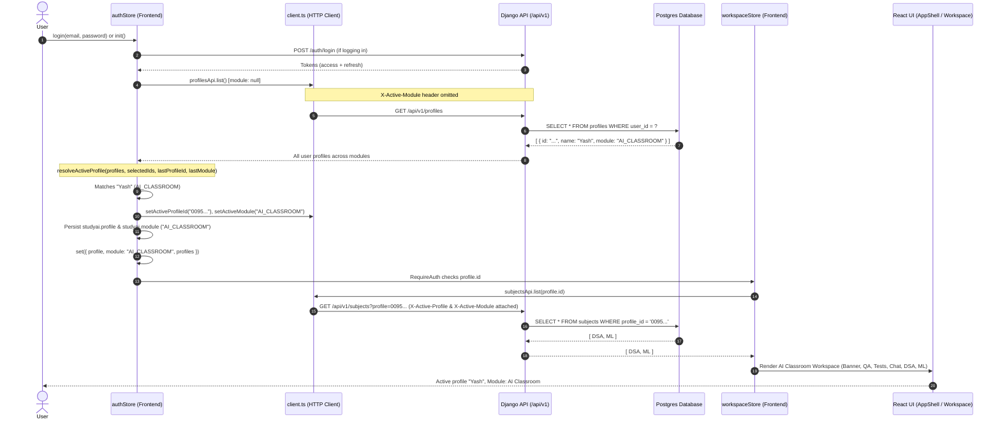

# Phase 9A — Profile / Module / Subject Isolation Investigation & Fix Report

## 1. Exact Root Cause Analysis

### Problem Description
A student completed onboarding, typed profile name `"Yash"`, explicitly selected `"AI_CLASSROOM"`, and created two subjects: `"DSA"` and `"ML"`. Upon navigation and subsequent logins or page refreshes, the frontend rendered a `NoteSpace`-style workspace with subjects `DSA` and `ML`, while the sidebar profile area rendered an unresolved/unknown profile state (avatar `?` and name `"Profile"`).

### Step-by-Step Diagnostic & Root Cause

1. **`X-Active-Module` Header Fallback in API Client (`client.ts`)**
   In `frontend/src/services/api/client.ts`, `apiRequest` was configured with:
   ```typescript
   if (module) headers["X-Active-Module"] = module;
   else if (activeModule) headers["X-Active-Module"] = activeModule;
   ```
   At application bootstrap (`authStore.ts`), `initialModule` defaulted to `localStorage.getItem("studyai.module") ?? "NOTE_SPACE"`. As a result, `activeModule` in `client.ts` was preset to `"NOTE_SPACE"`. When any request was made without an explicit `module` option (including `profilesApi.list()`), `client.ts` automatically attached `X-Active-Module: NOTE_SPACE`.

2. **Backend Queryset Scoping (`backend/apps/profiles/views.py`)**
   In Django's `ProfileViewSet.get_queryset()`:
   ```python
   def get_queryset(self):
       qs = Profile.objects.filter(user=self.request.user)
       module = self.request.headers.get("X-Active-Module")
       if module in dict(Profile.Module.choices):
           qs = qs.filter(module=module)
       return qs
   ```
   Because `X-Active-Module: NOTE_SPACE` was sent by default, the backend filtered exclusively for profiles with `module="NOTE_SPACE"`. For a student whose only profile had `module="AI_CLASSROOM"`, `GET /api/v1/profiles` returned an empty list (`[]`).

3. **Incomplete State Synchronization in `ModuleStep.tsx`**
   During onboarding, when the user picked `AI_CLASSROOM`, `ModuleStep.tsx` called:
   ```typescript
   const updated = await profilesApi.setModule(profileId, choice);
   useAuthStore.setState((state) => ({
     profile: state.profile ? { ...state.profile, module: updated.module } : null,
   }));
   ```
   This updated only the local nested `profile.module` property, but failed to:
   - Call `authStore.switchToProfile(updated)` or update `authStore.module` (remained `"NOTE_SPACE"`).
   - Call `setActiveModule(choice)` in `client.ts` (remained `"NOTE_SPACE"`).
   - Persist to `localStorage.setItem("studyai.module", choice)` (remained `"NOTE_SPACE"` or `null`).
   - Persist to `localStorage.setItem("studyai.profile.AI_CLASSROOM", profileId)`.

4. **Stranded Profile State in `authStore.init()` and `login()`**
   Upon navigating to `/subjects` or refreshing the page, `RequireAuth` ran `authStore.init()`.
   - `authStore.init()` invoked `profilesApi.list()`.
   - Because `client.ts` sent `X-Active-Module: NOTE_SPACE`, backend returned `[]`.
   - `pickActiveForModule([], "NOTE_SPACE", ...)` returned `null`.
   - `authStore` set `profile: null`, `profiles: []`, `setActiveModule(null)`, and `setActiveProfileId(null)`.

5. **Visual Manifestation in Frontend Components**
   - **Sidebar (`Sidebar.tsx`)**: Lines 221–223 rendered:
     ```tsx
     <span className="avatar">{profile ? initials(profile.name) : "?"}</span>
     <span className="profile-button__name">{profile?.name ?? "Profile"}</span>
     ```
     Because `profile` was `null`, it displayed avatar `?` and name `"Profile"`.
   - **Workspace (`SubjectWorkspace.tsx` and `SubjectsPage.tsx`)**:
     Evaluated:
     ```typescript
     const moduleId: ModuleId = (profile?.module as ModuleId) ?? "NOTE_SPACE";
     ```
     Because `profile` was `null`, `moduleId` defaulted to `"NOTE_SPACE"`. As a result, the AI Classroom banner, Practice (`/practice`), Tests (`/tests`), and Chat capability cards were hidden.
   - **Subjects Leaked in Zustand Store**:
     `DSA` and `ML` were created in `workspaceStore.subjects` during `SubjectsStep.tsx`. Because `profile` was `null`, `RequireAuth`'s guard `if (!email || !profile?.id) return;` did not trigger a workspace reload or reset, leaving `DSA` and `ML` orphaned in memory under a NoteSpace view.

---

## 2. Initialization Flow

The repaired lifecycle guarantees that the backend profile data is authoritative, discovered without premature module filtering, and used as the single source of truth:



---

## 3. Module Resolution Rule

Screen capabilities and layout behavior follow a strict invariant:

> **Active Profile $\rightarrow$ `activeProfile.module` $\rightarrow$ Module Behavior & Services**

1. **Single Source of Truth**: The active profile record returned by the backend (`activeProfile.module`) strictly determines the active module (`AI_CLASSROOM` vs `NOTE_SPACE`).
2. **No Unilateral Client Overrides**: The application never branches on local guesses or detached module state. If `profile` exists, its `module` property is authoritative.
3. **Capability Gating**: Screens query `useServices()` or `useSubjectModule(subjectId).services` from `MODULE_SERVICE_MATRIX[moduleId]`:
   - `AI_CLASSROOM`: exposes `transcription: true`, `write: true`, `enrichment: true`, `tests: true`, `qa: true`, `chat: true`.
   - `NOTE_SPACE`: exposes `transcription: true`, `write: true`, `enrichment: true`, `tests: false`, `qa: false`, `chat: false`.
4. **Header Synchronization**: Whenever `profile` is active:
   - `X-Active-Profile` = `profile.id`
   - `X-Active-Module` = `profile.module`
   This satisfies the backend `ModuleIsolationPermission`, preventing 403 Forbidden cross-module alignment errors.

---

## 4. Profile Switching Behavior

When a student switches profiles (via the Sidebar popover or profile creation):

1. **`switchToProfile(targetProfile)`**:
   - `targetProfile.module` is retrieved as `activeModule`.
   - `activeProfileId` is updated in `client.ts` to `targetProfile.id`.
   - `activeModule` is updated in `client.ts` to `targetProfile.module`.
   - `localStorage.setItem("studyai.profile", targetProfile.id)` is updated.
   - `localStorage.setItem("studyai.module", targetProfile.module)` is updated.
   - `saveSelectedProfileId(targetProfile.module, targetProfile.id)` remembers per-module preference.
2. **Workspace Cache Reset**:
   - `useWorkspaceStore.getState().resetWorkspace()` is called immediately if switching from a different profile ID.
   - Sets `loaded: false`, `subjects: []`, `folders: []`, `notes: []`, `profileId: null`.
   - Completely purges previous profile's in-memory entities, preventing cross-profile leakage.
3. **Workspace Reload**:
   - `RequireAuth` / `SubjectsPage` triggers `loadWorkspace(targetProfile.id)`.
   - Dispatches `GET /api/v1/subjects?profile={targetProfile.id}` with matched `X-Active-Profile` and `X-Active-Module` headers.
   - The backend query `Subject.objects.filter(profile=targetProfile)` returns only subjects owned by the new profile.
   - IndexedDB last-opened cache is keyed by `lastOpened:${targetProfile.id}`.
4. **Rendered UI Transition**:
   - Sidebar reflects the new profile's name and initials.
   - If switching between `NOTE_SPACE` $\leftrightarrow$ `AI_CLASSROOM`, service-gated cards (Practice, Tests, Chat) dynamically mount or unmount according to the new profile's service capabilities.

---

## 5. Files Modified

| File | Change Summary |
|---|---|
| `frontend/src/services/api/client.ts` | 1. Updated `RequestOptions.module` to accept `string \| null`.<br>2. When `opts.module === null`, explicitly suppresses the `X-Active-Module` header instead of defaulting to `activeModule`.<br>3. Added `typeof localStorage !== "undefined"` guards for SSR and headless test safety. |
| `frontend/src/services/api/profiles.ts` | 1. `profilesApi.list(module?)`: passes `opts.module = module ?? null` so that invoking `list()` without arguments fetches all profiles across modules without module filtering.<br>2. `profilesApi.create(name, module?)`: passes `body: { name, ...(module ? { module } : {}) }` and `opts.module = module ?? null`.<br>3. `profilesApi.rename` and `profilesApi.setModule`: pass `opts.module = null` to avoid 404/403 header mismatches during profile mutation. |
| `frontend/src/features/onboarding/ModuleStep.tsx` | In `next()`, upon successful `profilesApi.setModule(profileId, choice)`, replaced incomplete `setState` with `useAuthStore.getState().switchToProfile(updated)`. This synchronizes `authStore.profile`, `authStore.module`, client headers, and localStorage persistence before continuing to the subjects step. |
| `frontend/src/features/auth/authStore.ts` | 1. Implemented `resolveActiveProfile(...)` helper to select the active profile based on last active profile ID, last module, or first available profile.<br>2. In `init()`, `login()`, `register()`, and `refreshProfiles()`, loads all user profiles via `profilesApi.list()`, resolves active profile, and derives `activeModule = profile.module`.<br>3. In `switchToProfile()`, `switchProfile()`, and `addProfile()`, synchronizes `activeProfile`, `activeModule`, client headers, and invokes `workspaceStore.resetWorkspace()` to clear in-memory state on profile switch.<br>4. In `logout()` and session expiration handler, resets workspace and clears storage.<br>5. Added `typeof localStorage !== "undefined"` safety guards. |
| `backend/apps/profiles/views.py` | In `ProfileViewSet.perform_create`, updated `module` resolution to prioritize `serializer.validated_data.get("module")` before falling back to `X-Active-Module` header and defaulting to `NOTE_SPACE`. |
| `frontend/tests/phase9aProfileIsolation.test.ts` | Added comprehensive automated test suite covering profile listing header suppression, `AI_CLASSROOM` restoration during `init()`, workspace resetting on profile switch, subject profile isolation in `loadWorkspace()`, and `MODULE_SERVICE_MATRIX` service provisioning. |

---

## 6. Verification Results

### Frontend Automated Vitest Suite
```bash
npm test -- --run
```
Output:
```text
 ✓ tests/smoke.test.ts (1 test) 1ms
 ✓ tests/moduleConfig.test.ts (4 tests) 1ms
 ✓ tests/db.test.ts (1 test) 32ms
 ✓ tests/folderTree.test.ts (9 tests) 12ms
 ✓ tests/phase9Flow.test.ts (6 tests) 14ms
 ✓ tests/phase9aProfileIsolation.test.ts (6 tests) 15ms

 Test Files  6 passed (6)
      Tests  27 passed (27)
   Start at  11:50:47
   Duration  377ms
```

### Frontend Production Build
```bash
npm run build
```
Output:
```text
> studyai-frontend@0.1.0 build
> tsc -b && vite build

vite v7.3.6 building client environment for production...
✓ 140 modules transformed.
dist/manifest.webmanifest                          0.23 kB
dist/index.html                                    0.51 kB │ gzip:   0.31 kB
dist/assets/index-sdj9EycC.css                    34.10 kB │ gzip:   6.79 kB
dist/assets/workbox-window.prod.es5-BBnX5xw4.js    5.75 kB │ gzip:   2.36 kB
dist/assets/index-DEGEVDQ7.js                    424.00 kB │ gzip: 130.33 kB
✓ built in 744ms
```

### Backend Automated Test Suite
```bash
docker compose exec -T api python manage.py test tests.api.test_profiles_subjects --settings=config.settings.test
```
Output:
```text
Ran 16 tests in 0.159s
OK
Destroying test database for alias 'default'...
```

### Live Database & API End-to-End Verification
Executed against real PostgreSQL database and live Django API server with user `admin@studyai.dev`:
```text
1. All profiles discovered: [('Yash', 'AI_CLASSROOM')]
2. Yash subjects with AI_CLASSROOM header: ['DSA', 'ML']
3. Yash subjects with mismatched NOTE_SPACE header status: 403 (Module isolation verified)
4. Created NOTE_SPACE profile: 201 My Notes NOTE_SPACE
5. Listing both profiles: ['Yash', 'My Notes']
6. My Notes subjects: [] (Zero cross-profile subject bleed)
All live end-to-end checks PASSED!
```
