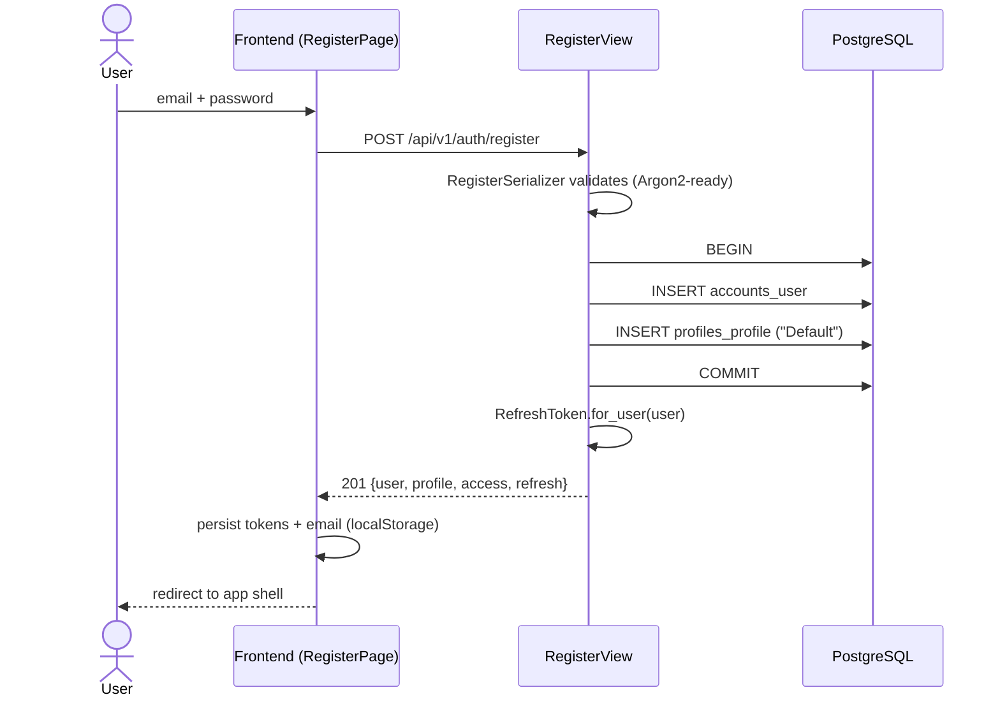
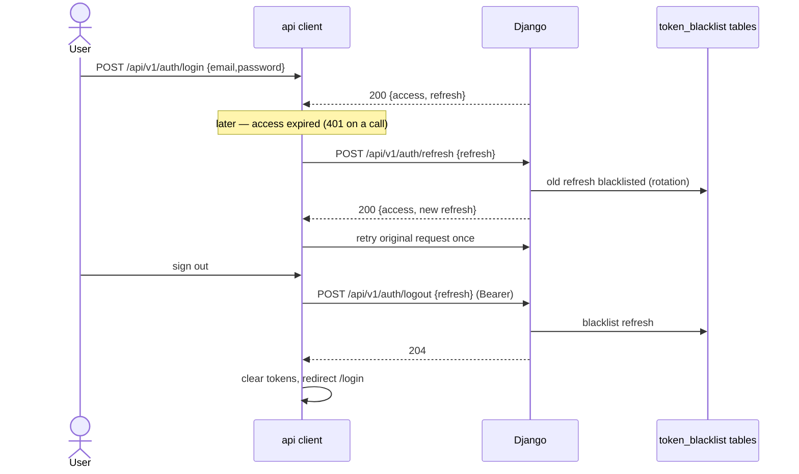
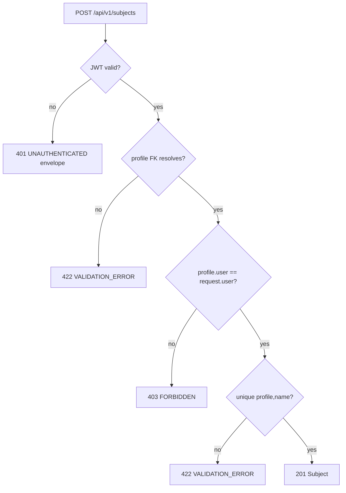
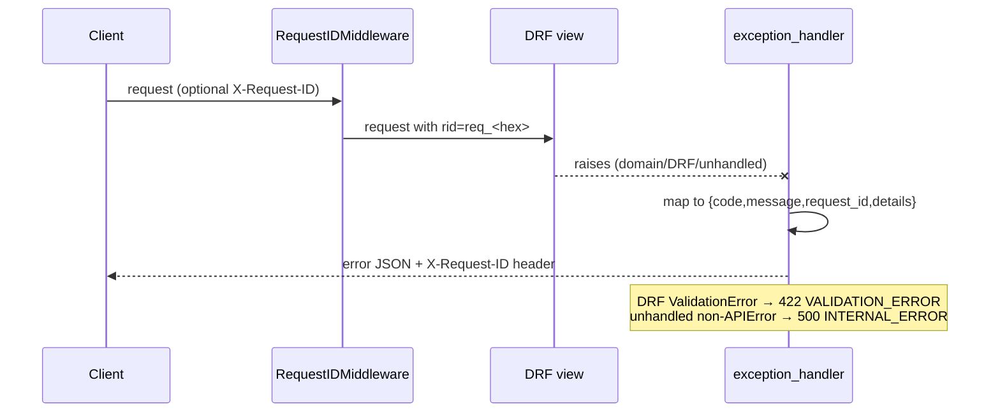
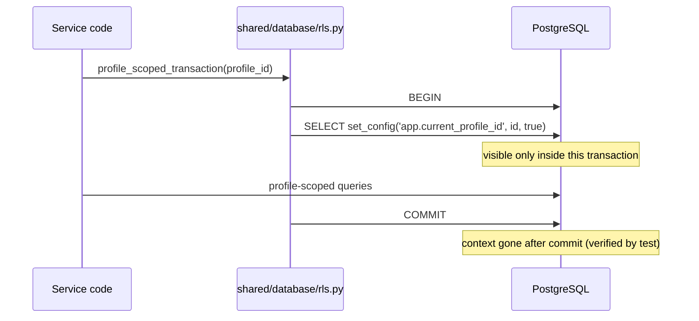
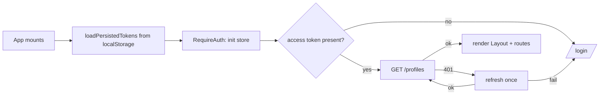

# System Flows — Implemented Only

Every diagram below reflects code that exists. Flows that do **not** exist yet are listed at the end with ❌.

## 1. Registration

Failures: invalid/short password or duplicate email → `422 VALIDATION_ERROR` envelope.

## 2. Login / refresh / logout

If refresh also fails → session-expired handler clears state and routes to `/login`.

## 3. Subject creation (authorization path)

List/read isolation is structural: querysets filter `profile__user=request.user`, so foreign rows never match.

## 4. Error envelope & request IDs

## 5. RLS context binding (used by services/tests today; workers later)

## 6. Frontend authenticated page load

## Not yet implemented flows (❌)

Per spec §43–§59 — none of these exist in code:

- Note upload → direct-to-storage upload → finalize → revision creation
- OCR job processing (primary/fallback) → DocumentLine persistence
- OCR review/edit → new immutable revision
- Canvas autosave/outbox sync against backend; heartbeat/takeover fencing
- NoteSpace layout extraction → PDF render → signed download
- Chunking → embedding → hybrid retrieval
- Enrichment pipeline (retrieve→draft→gap→cite→verify) → EnrichedNote persistence
- Tag extraction → stable-tag upsert → TagChangeLog
- Question generation → adaptive test assembly → attempt scoring → mastery update
- Chat: scoped retrieval → LLM → citation verification → persist message
- Revision planner goal/plan generation
- Reference-book admin ingestion
- Job lifecycle endpoints (`GET /jobs/{id}`, cancel)

These will be added to this document as they are implemented.
