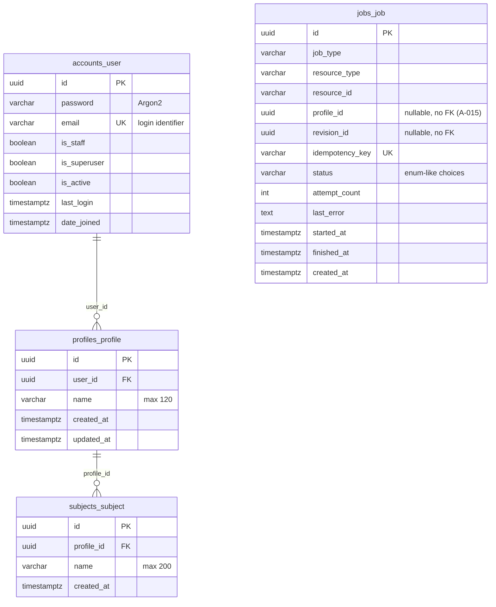

# Database Schema

PostgreSQL 18. All domain PKs are UUIDs. Migrations are per-app under `apps/*/migrations/`.

## ER diagram (actual)



SimpleJWT also manages `token_blacklist_outstandingtoken` (FK → user, CASCADE) and `token_blacklist_blacklistedtoken` (FK → outstanding token). Standard Django tables (`django_session`, `django_admin_log`, `django_content_type`, `django_migrations`, auth group/permission tables) exist but are unused by the API.

## Tables in detail

### `accounts_user` — `apps/accounts/models.py`
Custom `AUTH_USER_MODEL`. `id` UUID default `uuid4`; `email` unique, lowercased at the serializer; `username` **removed**; password hashed with Argon2 (`PASSWORD_HASHERS[0]`). No additional columns.

### `profiles_profile` — `apps/profiles/models.py`

| Column | Type | Constraints |
|---|---|---|
| id | uuid | PK |
| user_id | uuid | FK → accounts_user ON DELETE CASCADE |
| name | varchar(120) | |
| created_at / updated_at | timestamptz | auto-now-add / auto-now |

Constraints: `uniq_profile_user_name UNIQUE (user_id, name)`.
RLS: enabled; policy `profile_isolation_profiles_profile USING (id::text = current_setting('app.current_profile_id', true))`.

### `subjects_subject` — `apps/subjects/models.py`

| Column | Type | Constraints |
|---|---|---|
| id | uuid | PK |
| profile_id | uuid | FK → profiles_profile ON DELETE CASCADE |
| name | varchar(200) | |
| created_at | timestamptz | auto |

Constraints: `uniq_subject_profile_name UNIQUE (profile_id, name)`.
RLS: enabled; policy `profile_isolation_subjects_subject USING (profile_id::text = current_setting('app.current_profile_id', true))`.

### `jobs_job` — `apps/jobs/models.py`

| Column | Type | Notes |
|---|---|---|
| id | uuid | PK |
| job_type | varchar(100) | free-form today (`ocr`, `embedding`, … planned) |
| resource_type / resource_id | varchar(100)/varchar(64) | polymorphic target |
| profile_id | uuid nullable | **plain column, no FK** (decision A-015); RLS key for workers |
| revision_id | uuid nullable | reserved for Phase 3 linkage |
| idempotency_key | varchar(255) | UNIQUE — duplicate-processing guard |
| status | varchar(32) | choices: queued/running/failed_retryable/failed_dead_letter/cancelling/cancelled/succeeded (Django TextChoices, no DB enum type) |
| attempt_count | integer ≥ 0 | incremented on claim |
| last_error | text | truncated to 4000 chars by helpers |
| started_at / finished_at | timestamptz nullable | |
| created_at | timestamptz | |

Indexes: `(status, created_at)`; `(job_type, resource_type, resource_id)`.

## Enums, checks, triggers, vectors

- **Enums:** none at DB level — statuses are Django `TextChoices` (varchar + app validation).
- **Check constraints:** none beyond NOT NULL/unique.
- **Triggers:** none.
- **Vector columns / full-text:** none yet — pgvector extension not installed; `tsvector` arrives with Phase 5.

## RLS

```sql
-- migration apps/subjects/migrations/0002_enable_rls.py (no-op on SQLite)
ALTER TABLE profiles_profile ENABLE ROW LEVEL SECURITY;
CREATE POLICY profile_isolation_profiles_profile ON profiles_profile
  USING (id::text = current_setting('app.current_profile_id', true));

ALTER TABLE subjects_subject ENABLE ROW LEVEL SECURITY;
CREATE POLICY profile_isolation_subjects_subject ON subjects_subject
  USING (profile_id::text = current_setting('app.current_profile_id', true));
```

Application binding: `shared/database/rls.py::set_profile_context` executes `SELECT set_config('app.current_profile_id', %s, true)` inside `transaction.atomic()`.

**Caveat:** the dev role (`yash`) is a superuser ⇒ PostgreSQL exempts it from RLS. Policies were verified present via `pg_policies`; behavioral enforcement must be validated against a restricted role before production.

## Migration strategy

- Standard Django migrations; forward-only in practice.
- Current chain: `accounts 0001`, `profiles 0001`, `subjects 0001` + `0002_enable_rls`, `jobs 0001`, plus Django/SimpleJWT built-ins.
- RLS migration is vendor-guarded (`schema_editor.connection.vendor != 'postgresql'` → no-op), so SQLite test runs succeed.
- Future pgvector adoption will require a migration installing the extension (`CREATE EXTENSION IF NOT EXISTS vector`) with appropriate privileges.

## Deviations from architecture spec

1. Spec §29 shows `Job.profile_id` among profile-owned resources; implemented as plain UUID without FK (decision A-015) to avoid premature cascade semantics.
2. Spec §66 lists constraints for future tables (DocumentPage, NoteChunk, Tag, Question) — those tables don't exist yet.
3. Everything else matches the spec's Phase-1-relevant schema exactly.
