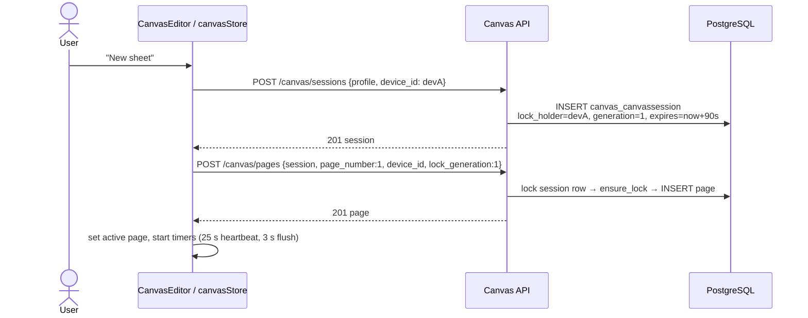
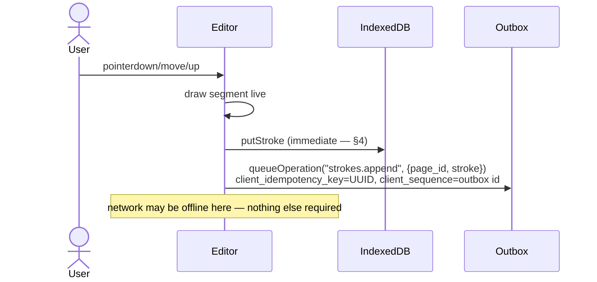
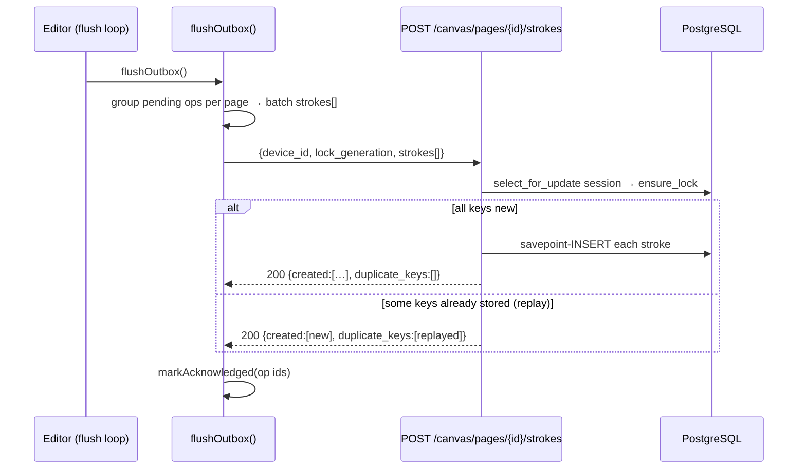

# System Flows — after Phase 2

All diagrams reflect implemented code. Phase 1 flows (registration, login/refresh/logout, subject authorization, error envelope, RLS binding) are documented in [`../phase_1/architecture/SYSTEM_FLOWS.md`](../../phase_1/architecture/SYSTEM_FLOWS.md) and remain accurate.

## 1. Canvas session bootstrap



## 2. Stroke capture and offline-first persistence



## 3. Outbox flush with idempotent replay protection



## 4. Fencing: stale device loses the session (§5)

```mermaid
sequenceDiagram
    participant A as Device A (gen 1)
    participant B as Device B
    participant API as Canvas API

    A->>A: backgrounded — heartbeats stop
    B->>API: POST /canvas/sessions/{id}/takeover {device_id: devB}
    API-->>B: 200 generation=2, holder=devB
    A->>API: POST strokes {device_id: devA, lock_generation: 1}
    API->>API: ensure_lock: generation 1 ≠ 2
    API-->>A: 409 SESSION_LOCK_LOST envelope
    A->>A: banner shown; drawing disabled
    A->>API: POST takeover {device_id: devA} (user clicks Take over)
    API-->>A: 200 generation=3, holder=devA — resumes
```

Expiry path: a write (or heartbeat) after `lock_expires_at` also yields 409 SESSION_LOCK_LOST even if holder+generation still match.

## 5. Finalize (§67 transaction boundary)

```mermaid
flowchart TD
    A[POST /canvas/pages/{id}/finalize] --> B{lock valid?}
    B -- no --> C[409 SESSION_LOCK_LOST]
    B -- yes --> D{already finalized?}
    D -- yes --> E[200 already_finalized=true]
    D -- no --> F[BEGIN · mark finalized + finalized_at · COMMIT]
    F --> G[200 is_finalized=true]
    H[any later strokes POST] --> I[409 REVISION_CONFLICT]
```

Phase 3 will extend transaction F with document revision creation + OCR job enqueue (marked extension point in `CanvasSyncService.finalize_page`).

## 6. Heartbeat lifecycle

```text
session active ──▶ every 25 s: POST heartbeat {device_id, generation}
                        ├─ 200 → refresh expiry, adopt returned state
                        ├─ 409 SESSION_LOCK_LOST → lockLost banner
                        └─ transient error → retry next beat
tab closed / another device takes over ──▶ server lock expires after ≤90 s
```

## Not yet implemented flows (❌)

Unchanged from Phase 1: upload→OCR→canonical revisions, NoteSpace PDF, chunking/embedding/retrieval, enrichment, tags/questions/tests/chat/revision, reference books, job-producing endpoints. See [`../phase_1/architecture/SYSTEM_FLOWS.md`](../../phase_1/architecture/SYSTEM_FLOWS.md) §"Not yet implemented".
