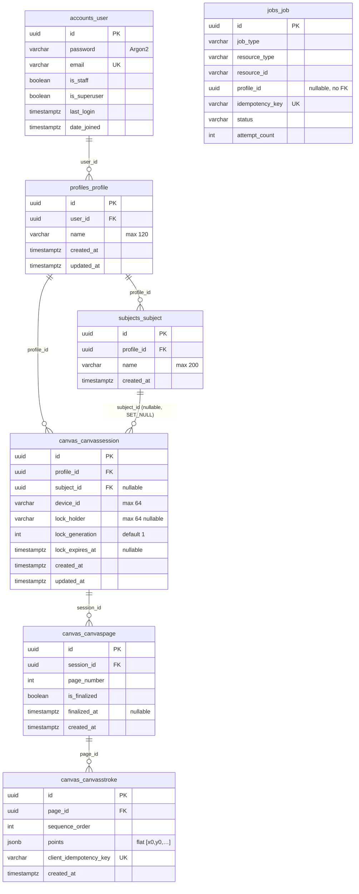

# Database Schema — after Phase 2

PostgreSQL 18. All domain PKs are UUIDs. Migrations per app under `apps/*/migrations/`.

## ER diagram (actual)



SimpleJWT tables (`token_blacklist_*`) and standard Django tables also exist (unchanged from Phase 1).

## New in Phase 2

### `canvas_canvassession` — `apps/canvas/models.py`

| Column | Type | Notes |
|---|---|---|
| id | uuid PK | |
| profile_id | uuid FK → profiles_profile | CASCADE; tenant boundary |
| subject_id | uuid FK → subjects_subject | **SET_NULL**, nullable — deleting a subject keeps the sheet |
| device_id | varchar(64) | creating device |
| lock_holder | varchar(64) nullable | current owning device |
| lock_generation | integer ≥ 1 default 1 | fencing token (§5) |
| lock_expires_at | timestamptz nullable | TTL = `CANVAS_LOCK_TTL_SECONDS` (90 s) |
| created_at / updated_at | timestamptz | |

Indexes: `(profile, created_at)`.

### `canvas_canvaspage`

| Column | Type | Notes |
|---|---|---|
| id | uuid PK | |
| session_id | uuid FK → canvas_canvassession | CASCADE |
| page_number | integer ≥ 0 | |
| is_finalized | boolean default false | immutable once true (enforced in service layer) |
| finalized_at | timestamptz nullable | |
| created_at | timestamptz | |

Constraints: `uniq_canvas_page_session_number UNIQUE (session_id, page_number)` (§66).

### `canvas_canvasstroke`

| Column | Type | Notes |
|---|---|---|
| id | uuid PK | client may supply its UUID; server generates otherwise |
| page_id | uuid FK → canvas_canvaspage | CASCADE |
| sequence_order | integer ≥ 0 default 0 | client-assigned ordering |
| points | JSONB | flat `[x0,y0,x1,y1,…]` (decision B-005) |
| client_idempotency_key | varchar(64) **UNIQUE** | replay protection (§4, decision B-001) |
| created_at | timestamptz | |

Indexes: `(page, sequence_order)`.

## RLS policies (cumulative)

| Table | Policy | USING clause |
|---|---|---|
| profiles_profile | profile_isolation_profiles_profile | `id::text = GUC` |
| subjects_subject | profile_isolation_subjects_subject | `profile_id::text = GUC` |
| canvas_canvassession | profile_isolation_canvas_canvassession | `profile_id::text = GUC` |
| canvas_canvaspage | profile_isolation_canvas_canvaspage | `EXISTS (SELECT 1 FROM canvas_canvassession s WHERE s.id=session_id AND s.profile_id::text=GUC)` |
| canvas_canvasstroke | profile_isolation_canvas_canvasstroke | `EXISTS (… pages p JOIN sessions s … WHERE p.id=page_id AND s.profile_id::text=GUC)` |

GUC = `current_setting('app.current_profile_id', true)`. Same caveat as Phase 1: dev superuser bypasses RLS; enforcement requires a restricted role.

## Enums / checks / triggers / vectors

Unchanged: no DB-level enums (Django TextChoices), no check constraints beyond NOT NULL/unique, no triggers, no vector/FTS columns yet.

## Migration list (cumulative)

```text
accounts   0001_initial
profiles   0001_initial
subjects   0001_initial, 0002_enable_rls
jobs       0001_initial
canvas     0001_initial, 0002_enable_rls
+ Django/SimpleJWT built-ins
```

## Deviations from spec schema

1. No server-side `SyncOperation` table (§29 diagram) — replaced by stroke-level unique client keys (decision B-001).
2. `jobs_job.profile_id` plain UUID without FK (A-015).
3. All §29 entities beyond the above remain future work.
