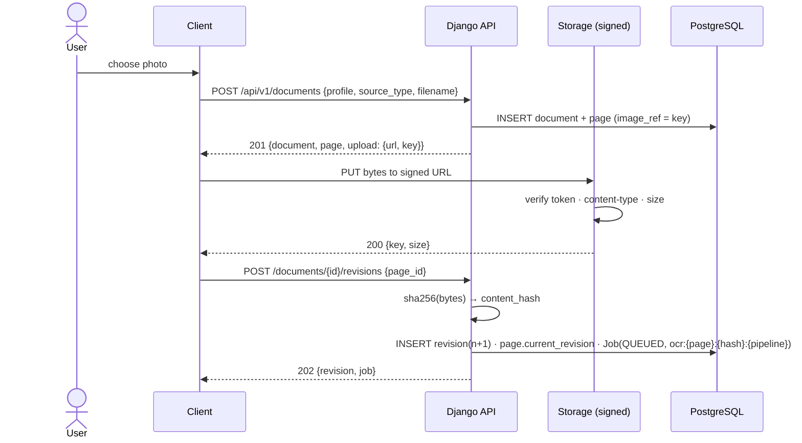
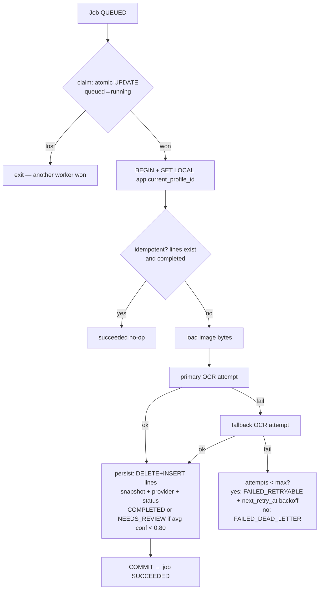
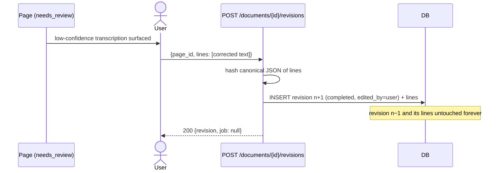
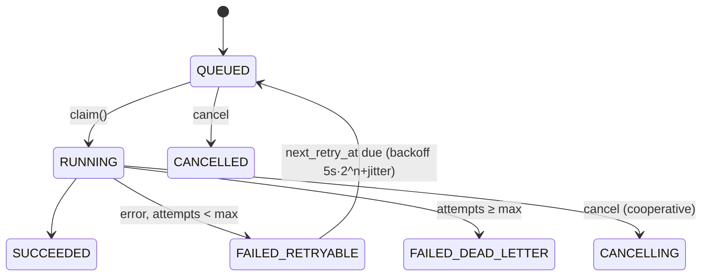

# System Flows — after Phase 3

Phase 1/2 flows remain valid: [`../phase_1/architecture/SYSTEM_FLOWS.md`](../../phase_1/architecture/SYSTEM_FLOWS.md), [`../phase_2/architecture/SYSTEM_FLOWS.md`](../architecture/SYSTEM_FLOWS.md). This page adds the ingestion flows.

## 1. Photo upload → canonical revision (§45–46)



## 2. OCR job execution (§47 worker flow)



## 3. Review & edit flow (§48)



## 4. Canvas finalize → full §67 transaction

```mermaid
sequenceDiagram
    participant ED as Editor (finalize button)
    participant CS as CanvasSyncService.finalize_page
    participant R as raster.py
    participant ST as Storage
    participant DB as PostgreSQL

    ED->>CS: POST /canvas/pages/{id}/finalize {device_id, lock_generation}
    CS->>DB: lock session row → ensure_lock (fencing)
    CS->>DB: mark canvas page finalized
    CS->>R: render strokes → PNG (stdlib)
    CS->>ST: store_bytes(profile/page.png)
    CS->>DB: get-or-create Document(canvas) · INSERT DocumentPage · INSERT Revision(hash) · get-or-create OCR Job
    CS-->>ED: 200 {document_id, revision_id, job_id}
    Note over DB: all DB writes in ONE transaction; storage write precedes commit<br/>(rollback ⇒ orphaned object only)
```

## 5. Failure → retry → dead-letter (§19–20, §28)



Retry-processing endpoint resets failed jobs for the current revision to QUEUED and re-dispatches; succeeded jobs return `422`.

## Not yet implemented flows (❌)

Chunking/embedding/retrieval/enrichment downstream of OCR completion (extension point exists in `run_ocr_job`); NoteSpace PDF rendering; reference books; AI Classroom features.
