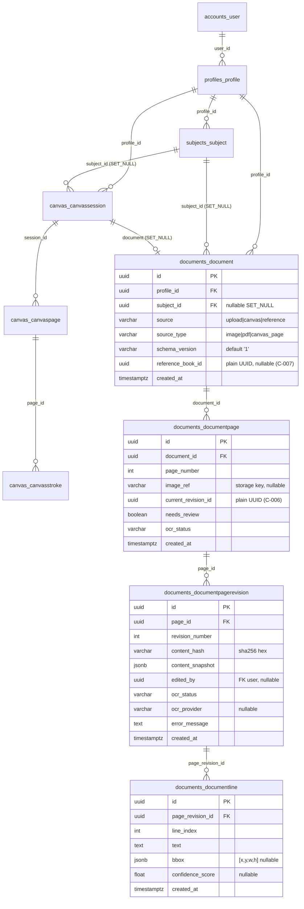

# Database Schema — after Phase 3

PostgreSQL 18, UUID PKs throughout. Migrations per app.

## ER diagram (actual)



`jobs_job` gained `next_retry_at timestamptz NULL` (Phase 3) — see [`../phase_2/backend/DATABASE_SCHEMA.md`](../../phase_2/backend/DATABASE_SCHEMA.md) for its full definition. CanvasSession gained `document_id uuid FK → documents_document NULL ON DELETE SET NULL`.

## §66 constraints implemented (cumulative)

| Constraint | Migration |
|---|---|
| unique(user,name) Profile | profiles 0001 |
| unique(profile,name) Subject | subjects 0001 |
| unique(session,page_number) CanvasPage | canvas 0001 |
| unique(document,page_number) DocumentPage | documents 0001 |
| unique(page,revision_number) DocumentPageRevision | documents 0001 |
| unique(revision,line_index) DocumentLine | documents 0001 |
| unique(idempotency_key) Job | jobs 0001 |
| unique(client_idempotency_key) CanvasStroke | canvas 0001 |

## RLS policies (cumulative)

Direct `profile_id::text = GUC`: profiles_profile · subjects_subject · canvas_canvassession · documents_document.
EXISTS chains: canvas pages/strokes (→session), document pages/revisions/lines (→document). GUC = `current_setting('app.current_profile_id', true)`; unset ⇒ fail-closed. Superuser-bypass caveat unchanged.

## Migrations added in Phase 3

```text
documents  0001_initial · 0002_enable_rls
canvas     0003_canvassession_document
jobs       0002_job_next_retry_at
```

## Enums / vectors

OCR status enums are Django TextChoices on both page and revision (`pending/processing/completed/needs_review/failed`). Still no DB-level enums, check constraints, triggers, or vector/FTS columns.
