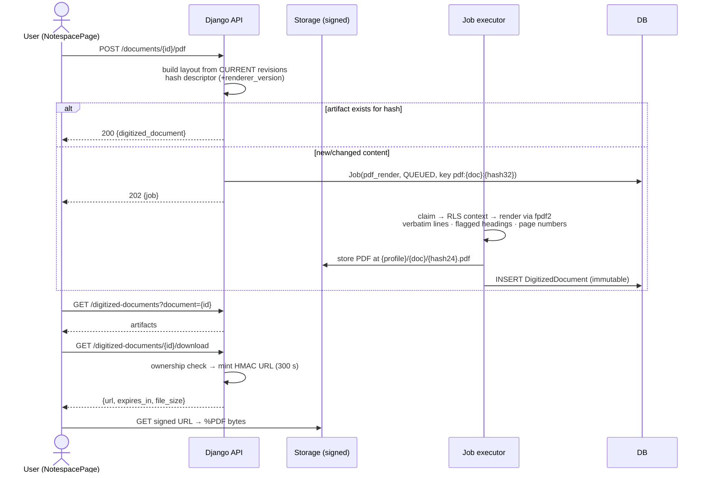
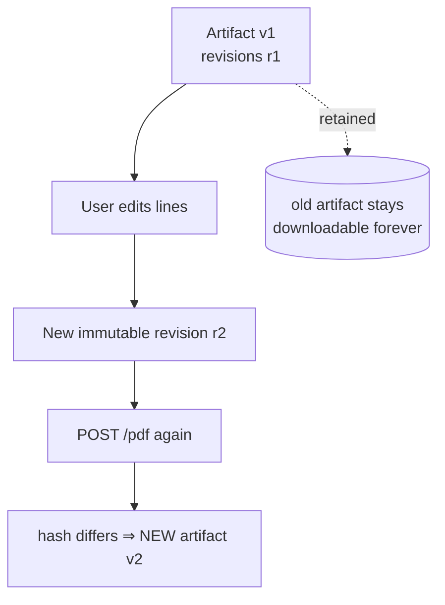

# System Flows — after Phase 4

Phase 1–3 flows remain valid: [`../phase_1/architecture/SYSTEM_FLOWS.md`](../../phase_1/architecture/SYSTEM_FLOWS.md), [`../phase_2/…`](../architecture/SYSTEM_FLOWS.md), [`../phase_3/…`](../architecture/SYSTEM_FLOWS.md). New: the NoteSpace render flow.

## NoteSpace: transcription → typed PDF (§49)



## Edit → regeneration lifecycle (§48 + §27)



## Faithfulness boundary (by construction)

```text
render_pdf input:  [{page_number, lines:[{text, is_heading}]}]
render_pdf output: every text verbatim, same order; heading styling only
                   when flagged; footer page numbers; document metadata
NO code path in the renderer can summarize, correct, or add content.
```

Not yet implemented flows (❌): everything downstream of OCR — chunking/embedding/retrieval/enrichment/AI Classroom features; reference books.
