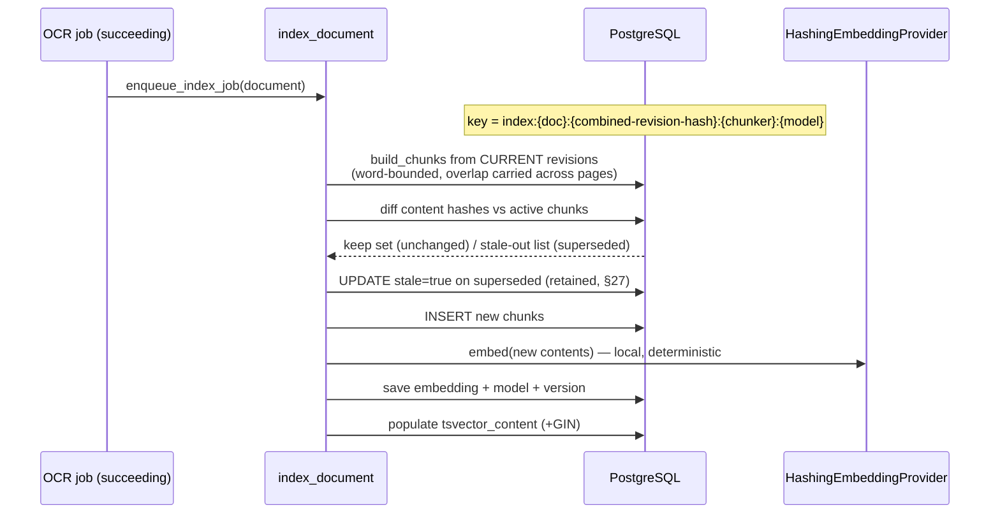
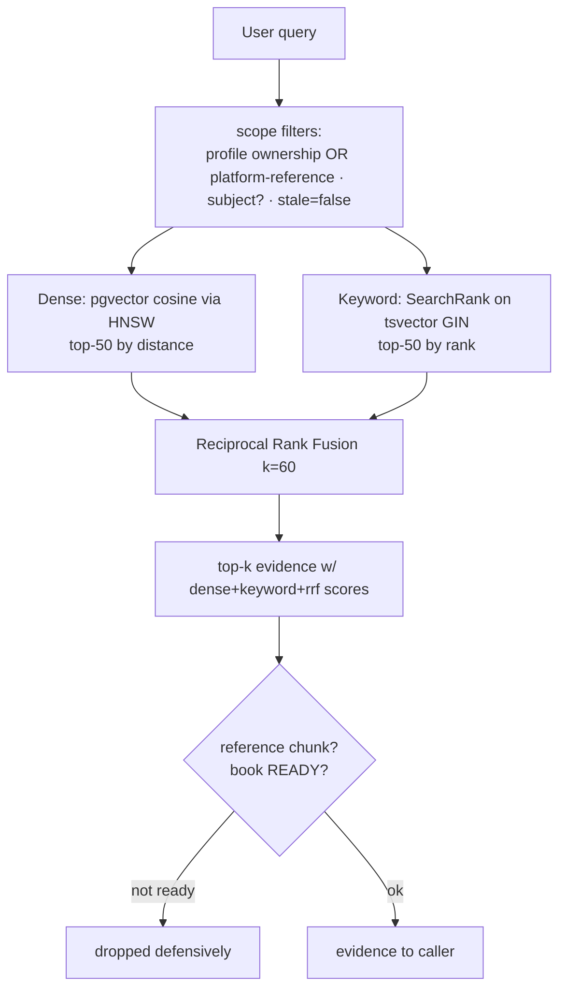

# System Flows — after Phase 5

Prior flows remain valid: [`../phase_1/…`](../../phase_1/architecture/SYSTEM_FLOWS.md), [`../phase_2/…`](../../phase_2/architecture/SYSTEM_FLOWS.md), [`../phase_3/…`](../architecture/SYSTEM_FLOWS.md), [`../phase_4/…`](../architecture/SYSTEM_FLOWS.md). New: indexing and retrieval flows.

## 1. Indexing — OCR completion → chunks + embeddings (§10, §47)



## 2. Hybrid retrieval with RRF (§14)



## 3. Edit → invalidation lifecycle (§10)

```mermaid
sequenceDiagram
    actor U as User
    participant API as POST /documents/{id}/revisions (edit mode)
    participant DB as PostgreSQL

    U->>API: corrected lines for page P
    API->>DB: INSERT revision n+1 (immutable)
    API->>API: enqueue_index_job(document)
    Note over DB: hash-diff: old page-P chunks stale=true;<br/>new content chunk inserted + embedded;<br/>untouched pages keep their embeddings
```

## 4. Reference-book ingestion (§15)

```mermaid
sequenceDiagram
    participant A as Admin (command)
    participant DB as PostgreSQL
    participant EX as Executor (eager/broker)

    A->>A: read book.json
    A->>DB: INSERT Document(source=reference, profile=NULL) + pages/revisions/lines per chapter
    A->>DB: INSERT ReferenceBook(processing) + chapters
    A->>EX: enqueue_index_job(book.document)
    EX->>DB: chunk + embed + tsvector
    alt eager mode
        EX-->>A: job succeeded → book READY
    else broker mode
        Note over A: book stays PROCESSING until a worker finishes; READY gating keeps it out of retrieval meanwhile
    end
```

Not yet implemented flows (❌): enrichment/citations/questions/chat consumption of evidence; evaluation harness.
