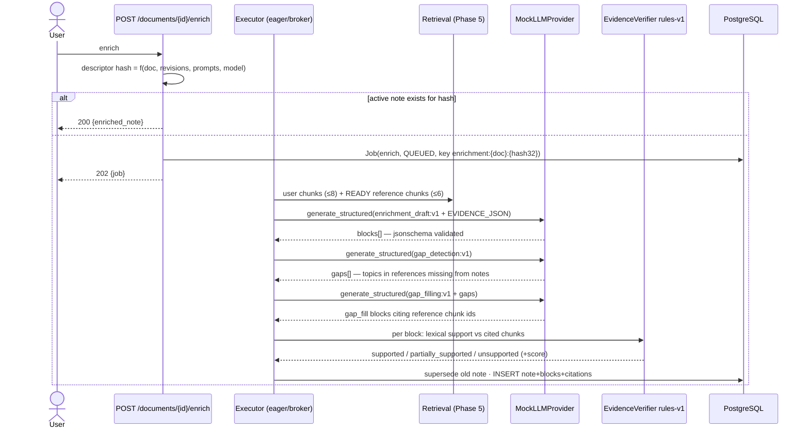
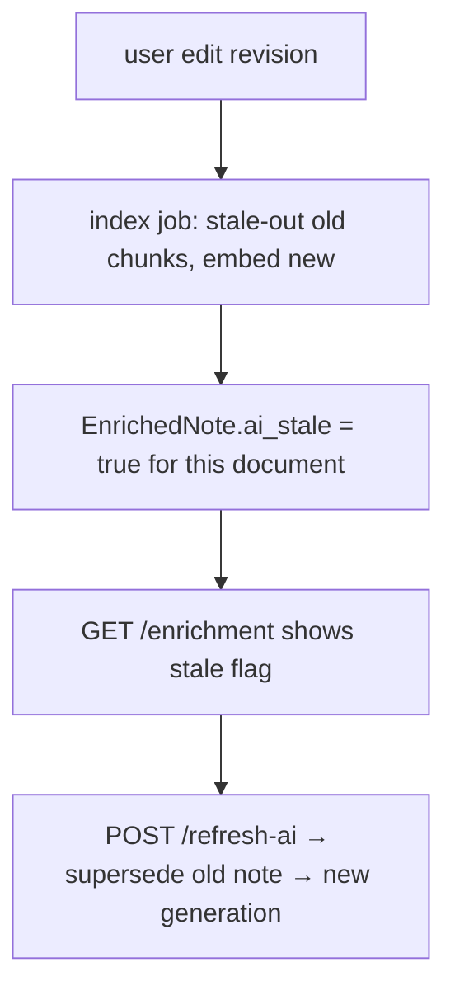

# System Flows — after Phase 6

Prior flows remain valid: [`../phase_5/architecture/SYSTEM_FLOWS.md`](../architecture/SYSTEM_FLOWS.md) and earlier phases. New: the enrichment pipeline.

## Enrichment A–F (§11, §51) — implemented flow



## Provenance ⊥ verification (§12)

```text
block.generation_method = llm            ← how it was produced (never rewritten)
citation.verification_status = supported | partially_supported | unsupported
                              ← whether cited chunks actually support it
Example observed in E2E:
  overview block  → method llm, status unsupported (meta-text, score 0.0)
  key_concept     → method llm, status supported   (score 1.0, verbatim source)
  gap_fill        → method llm, status supported   (score 0.83, reference book)
```

## ai-stale propagation (§21/§27)



## Failure isolation (§28/§52)

Enrichment failure ⇒ job FAILED_RETRYABLE/DEAD_LETTER only. Canonical documents, revisions, PDFs and NoteSpace remain fully available; `refresh-ai` or a retry re-attempts.

## Not yet implemented flows (❌)

Question generation → adaptive tests → mastery updates; chatbot consumption of evidence; tags hierarchy; revision planner; coalescing/quota budgets.
