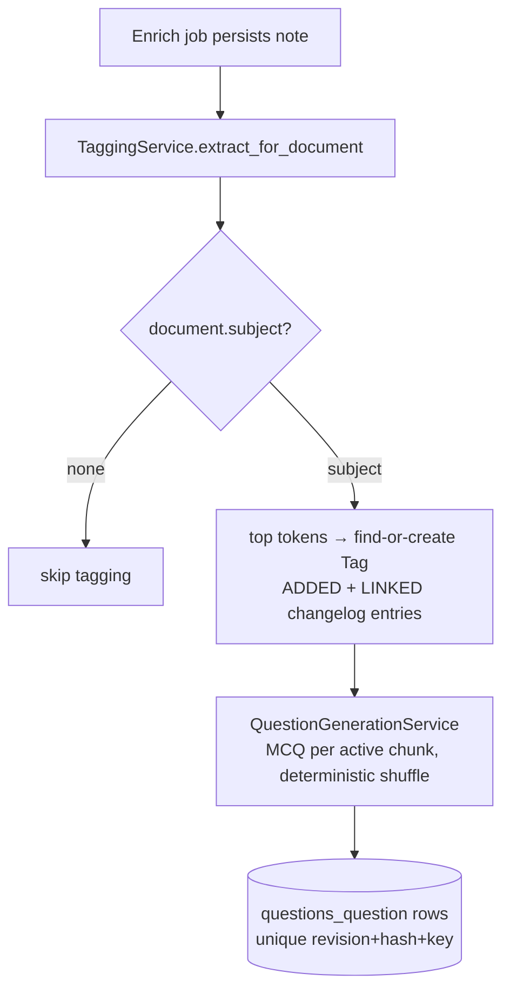
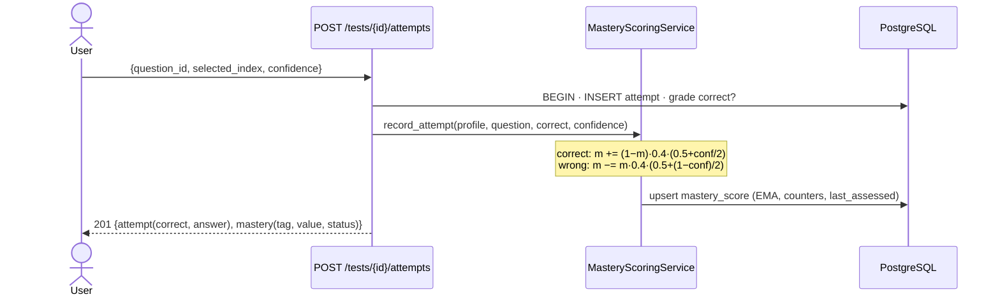
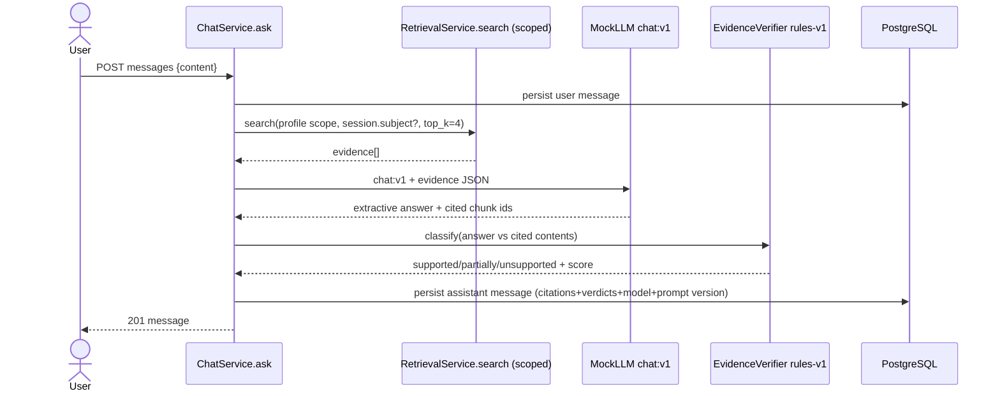

# System Flows — after Phase 7

Prior flows remain valid: [`../phase_6/architecture/SYSTEM_FLOWS.md`](../architecture/SYSTEM_FLOWS.md) and earlier phases. New: the learning loop.

## 1. Enrichment tail → tags + questions (§53/§54)



## 2. Adaptive test assembly (§55) — deterministic

```text
eligible = non-stale questions in profile (+ optional subject)
priority(q) = 0.6·(1−mastery_or_0.5)
            + 0.25·recency_bonus      (1.0 never attempted; decays over 7 days)
            + 0.15·difficulty_match   (medium = 1.0)
sort desc by (priority, pk) → take N
```

Same mastery/attempt state ⇒ identical selection (asserted by test).

## 3. Attempt grading + mastery update (§56) — single transaction



Replay of the same question ⇒ `409 IDEMPOTENCY_CONFLICT` (G-007).

## 4. Chat with verified citations (§16/§57)



Cross-profile isolation: retrieval scoping makes foreign chunks unreachable; session access is owner-filtered (foreign → 404).

## 5. Revision planning (§58) — no LLM

```text
GET /revision/plans?target_date=…&hours=…
  candidates = subject∩profile-linked tags
  priority = weakness·0.45 + urgency·0.25 + recent-failures·0.20 + insufficient·0.10
  schedule: round-robin top tags across ≤14 days, 2 sessions/day
```

## Not yet implemented flows (❌)

Verifier/embedding calibration datasets; coalescing window and quota budgets; reranking stage.
