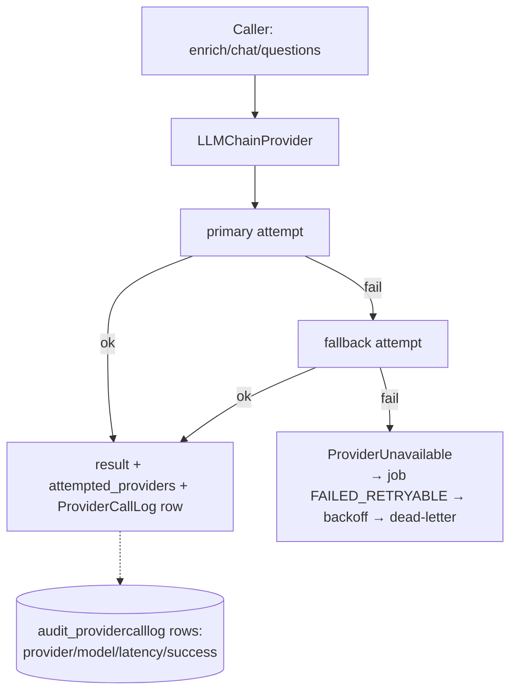
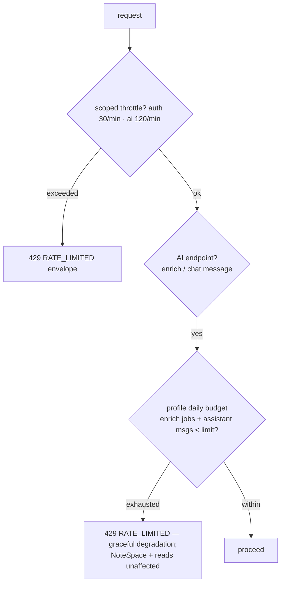

# System Flows — after Phase 8 (final)

Prior flows remain valid: [`../phase_7/architecture/SYSTEM_FLOWS.md`](../architecture/SYSTEM_FLOWS.md) and earlier. New: ops flows.

## 1. Health & readiness probes

```text
GET /healthz → 200 {"status":"ok"}                     (liveness, no deps checked)
GET /readyz   → 200 {"status":"ok","database":true}    (DB roundtrip)
              → 503 {"database":false}                 (degraded)
```

## 2. Provider fallback with telemetry (§28/§25)



## 3. Rate limiting + budget gates



## 4. Backup drill (§70) — performed

```text
manage.py backup_database
  → pg_dump -d studyai -f backups/studyai_YYYYMMDD_HHMMSS.sql
manage.py verify_backup --backup-file <file>
  → DROP/CREATE studyai_restore_verify
  → psql -f dump
  → smoke query row counts (documents=5, users=4 matched)
```

## 5. Regression gate (§26/§55)

```text
run_ai_evaluation --file cases.json --assert-gte recall_at_k=0.7 --assert-gte support_precision=0.8
  metrics < threshold ⇒ exit code 2 (CI fails)
```

## Not implemented flows (❌)

Scheduled backup automation; external alerting/APM; reranking; multi-node throttle store.
