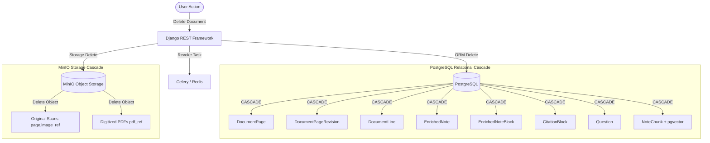

# Phase 10 — CRUD Audit and Product Scope Specification

**Document Version:** 1.0.0  
**Audit Branch:** `audit/phase-10-crud`  
**Date:** September 2026  
**Auditor:** Antigravity (Advanced Agentic Coding)  

---

## Executive Summary

StudyAI has successfully completed end-to-end flow verification across handwritten note ingestion, optical character recognition (OCR), vector retrieval, reference-grounded gap analysis, and citation-anchored enrichment.

However, an audit of the full CRUD (Create, Read, Update, Delete) surface across the application reveals an **asymmetric architecture**:
* The system is robust in **Create (Ingest)** and **Read (Present)** operations for educational documents and AI artifacts.
* **Update and Delete capabilities are either intentionally omitted, partially wired as dead code, or completely absent** from backend viewsets and frontend user interfaces.
* **Document metadata mutation does not exist in the database:** The `Document` model possesses no `title` or `folder_id` attributes in PostgreSQL. All document titling and folder organization currently reside strictly in browser IndexedDB state.
* **Storage deletion leaks:** PostgreSQL handles cascade deletions across database entities, but **MinIO object deletion is nowhere implemented**. Deleting database records leaves raw scans and synthesized PDFs orphaned in object storage.
* **Immutable revisions vs. mutable notes:** Content edits already branch immutably into `DocumentPageRevision` instances, but the UI lacks an edit surface for human transcription review.

This document presents a granular, evidence-based audit of all 11 core system entities, cascades, and security boundaries, followed by a scoped MVP product recommendation.

---

## 1. Full CRUD Scorecard

The following table summarizes the implementation status across all 11 system entities:

| Entity | Create | Read | Update | Delete | Backend API Status | Frontend UI Status | Audit Notes |
| :--- | :---: | :---: | :---: | :---: | :--- | :--- | :--- |
| **1. Profile** | ✅ | ✅ | ⚠️ Partial | ⚠️ Partial | ModelViewSet with `POST`, `GET`, `PATCH`, `DELETE` | Create (Modal), Read (Sidebar). Rename/Delete missing from UI. | DRF supports rename/delete; frontend API client has `rename/setModule`, but `authStore` and UI have no trigger. |
| **2. Subject** | ✅ | ✅ | ⚠️ Partial | ❌ Broken | `POST`, `GET`, `PATCH` exposed. `DELETE` explicitly excluded. | Create (Modal), Read (Cards/Sidebar). Rename in store only. Delete absent. | `SubjectViewSet.http_method_names` lacks `delete`. Calling `DELETE /api/v1/subjects/{id}` yields HTTP 405 Method Not Allowed. |
| **3. Folder (Notebook)** | ✅ | ✅ | ⚠️ Backend Only | ⚠️ Backend Only | ModelViewSet with `POST`, `GET`, `PATCH`, `DELETE` | Create (Modal), Read (Grid/Detail). Rename/Delete absent from UI. | `notebooksApi.rename` and `remove` exist in client, but are not wired to `workspaceStore` or UI. |
| **4. Note / Document** | ✅ | ✅ | ❌ None | ❌ None | ViewSet permits `POST`, `GET` only (`["get", "post", "head", "options"]`). | Create (Upload), Read (Detail). Title/Move/Delete absent. | DB lacks `title` and `folder_id`. Title and folders live in IndexedDB. `DELETE /api/v1/documents/{id}` yields 405. |
| **5. Document Page** | ⚠️ Auto | ✅ | ❌ None | ❌ None | Read (`/pages`, `/download`). Multi-page create/update unexposed. | Read only in `HandwrittenView`. | Auto-created on document upload (Page 1). No manual page add/reorder/delete. |
| **6. Document Revision** | ✅ | ✅ | 🚫 Immutable | 🚫 Immutable | `POST /documents/{id}/revisions` (Finalize / Edit), `GET`. | Read only (Transcript viewer). No edit trigger in UI. | Content edits intentionally generate immutable revisions (`DocumentPageRevision`). Client `submitEdit` exists but lacks UI button. |
| **7. Enriched Note** | ✅ (AI) | ✅ | 🔄 Regen | ❌ None | `POST /enrich`, `GET /enrichment`, `POST /refresh-ai`. | Read in `EnrichedView`. Regenerate button exists. | Generated asynchronously by LangGraph worker. Read-only to user. |
| **8. Enriched Note Block** | ✅ (AI) | ✅ | ❌ None | ❌ None | Internal to `EnrichedNote.blocks` (JSONField). | Read only in `EnrichedView`. | AI synthesized blocks. Direct editing is not permitted. |
| **9. Citation / Evidence** | ✅ (AI) | ✅ | 🚫 Immutable | 🚫 Immutable | Read via `EnrichedNoteBlock.citations` & `/evidence/{id}`. | Read only (Interactive chips & citation cards). | AI provenance record. Modifying or deleting citations directly violates grounding integrity. |
| **10. Practice Question**| ✅ (AI) | ✅ | 🚫 Immutable | 🚫 Immutable | Read via `GET /documents/{id}/questions`. | Read only in `PracticePage`. | Auto-generated by LangGraph pipeline. Questions are read-only study aids. |
| **11. Chat / Conversation**| ✅ | ✅ | ❌ None | ❌ None | `POST /chat/sessions`, `GET`, `POST .../messages`. | Create (New Chat), Read (Messages). Session rename/delete absent. | `ChatSessionViewSet.http_method_names` lacks `patch` and `delete`. Leaks: binds to `.first()` profile, ignoring `X-Active-Profile`. |

*Legend: ✅ Working End-to-End | ⚠️ Partial / Fragmented | ❌ Not Implemented / 405 | 🚫 Intentionally Immutable / Not Applicable | 🔄 Regeneration Only*

---

## Section A: Current Backend CRUD

### A.1 Profile (`backend/apps/profiles/`)
* **Model:** `Profile` in `backend/apps/profiles/models.py`. Fields: `id`, `user` (FK User), `name`, `type` (`STUDENT`, `EDUCATOR`, `RESEARCHER`), `active_module` (`AI_CLASSROOM`, `NOTESPACE`, etc.), `created_at`, `updated_at`.
* **ViewSet:** `ProfileViewSet` in `backend/apps/profiles/views.py` inherits from `viewsets.ModelViewSet`.
* **Allowed HTTP Methods:** Default DRF ModelViewSet methods (`GET`, `POST`, `PUT`, `PATCH`, `DELETE`, `HEAD`, `OPTIONS`).
* **Permissions:** `IsAuthenticated`, querysets strictly filtered by `user=request.user`.
* **Capabilities:**
  * `POST /api/v1/profiles`: Creates new profile for authenticated user.
  * `GET /api/v1/profiles`: Lists user's profiles (filterable by `module`).
  * `GET /api/v1/profiles/{id}`: Retrieves profile details.
  * `PATCH /api/v1/profiles/{id}`: Updates `name` or `active_module`.
  * `DELETE /api/v1/profiles/{id}`: Deletes profile (cascades to all associated data).

### A.2 Subject (`backend/apps/subjects/`)
* **Model:** `Subject` in `backend/apps/subjects/models.py`. Fields: `id`, `profile` (FK Profile), `name`, `description`, `color`, `icon`, `created_at`, `updated_at`.
* **ViewSet:** `SubjectViewSet` in `backend/apps/subjects/views.py`.
* **Allowed HTTP Methods:** Explicitly restricted:
  ```python
  http_method_names = ["get", "post", "patch", "head", "options"]
  ```
* **Permissions:** Scoped to `profile=request.profile` via `X-Active-Profile` header.
* **Capabilities:**
  * `POST /api/v1/subjects`: Creates new subject scoped to active profile.
  * `GET /api/v1/subjects`: Lists subjects for active profile.
  * `PATCH /api/v1/subjects/{id}`: Renames/updates subject metadata (`name`, `description`, `color`, `icon`).
  * `DELETE /api/v1/subjects/{id}`: **HTTP 405 Method Not Allowed**. Backend explicitly disallows deletion.

### A.3 Folder / Notebook (`backend/apps/notebooks/`)
* **Model:** `Notebook` in `backend/apps/notebooks/models.py`. Fields: `id`, `profile` (FK Profile), `subject` (FK Subject, nullable), `name`, `description`, `created_at`, `updated_at`. **Note:** No `parent_id` column exists in the relational schema; hierarchical folder nesting is entirely client-side.
* **ViewSet:** `NotebookViewSet` in `backend/apps/notebooks/views.py` inherits from `ModelViewSet`.
* **Allowed HTTP Methods:** Full standard set (`GET`, `POST`, `PUT`, `PATCH`, `DELETE`).
* **Permissions:** Filtered by `profile=request.profile`.
* **Capabilities:**
  * `POST /api/v1/notebooks`: Creates notebook.
  * `GET /api/v1/notebooks`: Lists notebooks.
  * `PATCH /api/v1/notebooks/{id}`: Updates notebook name/description.
  * `DELETE /api/v1/notebooks/{id}`: Deletes notebook (cascades or sets null).

### A.4 Document / Note (`backend/apps/documents/`)
* **Model:** `Document` in `backend/apps/documents/models.py`.
  * Fields: `id`, `profile` (FK Profile), `subject` (FK Subject, nullable), `created_at`, `updated_at`.
  * **Critical Architecture Finding:** `Document` has **NO `title`** column and **NO `folder_id` / `notebook_id`** column in PostgreSQL.
* **ViewSet:** `DocumentViewSet` in `backend/apps/documents/views.py`.
* **Allowed HTTP Methods:** Explicitly restricted:
  ```python
  http_method_names = ["get", "post", "head", "options"]
  ```
* **Permissions:** Scoped by `profile=request.profile`.
* **Capabilities:**
  * `POST /api/v1/documents`: Creates document, uploads scan to MinIO, generates `DocumentPage(page_number=1)`, queues OCR Celery task.
  * `GET /api/v1/documents`: Lists documents.
  * `GET /api/v1/documents/{id}`: Retrieves document details.
  * `PATCH / PUT /api/v1/documents/{id}`: **HTTP 405 Method Not Allowed**. Document attributes cannot be updated via REST.
  * `DELETE /api/v1/documents/{id}`: **HTTP 405 Method Not Allowed**. Document deletion is not exposed.

### A.5 Document Page (`backend/apps/documents/`)
* **Model:** `DocumentPage` in `backend/apps/documents/models.py`. Fields: `id`, `document` (FK Document), `page_number`, `image_ref` (MinIO key), `current_revision` (FK to DocumentPageRevision, nullable).
* **Endpoints:**
  * `GET /api/v1/documents/{id}/pages`: Lists pages for document.
  * `GET /api/v1/documents/pages/{id}/download`: Streams image binary from MinIO.
  * Update / Delete: Not exposed.

### A.6 Document Revision (`backend/apps/documents/`)
* **Model:** `DocumentPageRevision` in `backend/apps/documents/models.py`. Fields: `id`, `page` (FK DocumentPage), `revision_number`, `created_by` (FK User), `status` (`DRAFT`, `FINALIZED`), `created_at`.
* **Related Lines:** `DocumentLine` records containing bounding boxes (`box_2d`), OCR text (`text_content`), and confidence score.
* **Endpoints:**
  * `GET /api/v1/documents/{id}/revisions?page={page_id}`: Lists revisions with lines.
  * `POST /api/v1/documents/{id}/revisions`:
    * Mode 1 (Finalize): Transitions draft revision to `FINALIZED`.
    * Mode 2 (Submit Edit): Accepts `{page_id: str, lines: list}`. Creates a brand new immutable revision (`revision_number = max + 1`), sets `page.current_revision = new_rev`, invalidates stale vector chunks, marks `EnrichedNote.ai_stale = True`, and triggers re-chunking.
  * Revisions are strictly append-only and immutable by design.

### A.7 Enriched Note & Blocks (`backend/apps/ai_classroom/`)
* **Models:** `EnrichedNote` and `EnrichedNoteBlock` in `backend/apps/ai_classroom/models.py`.
* **Endpoints:**
  * `POST /api/v1/documents/{id}/enrich`: Triggers LangGraph Celery pipeline.
  * `GET /api/v1/documents/{id}/enrichment`: Fetches structured markdown blocks and citation links.
  * `POST /api/v1/documents/{id}/refresh-ai`: Re-runs enrichment pipeline when revisions update.
  * No manual mutation or deletion endpoints.

### A.8 Citations (`backend/apps/retrieval/`)
* **Model:** `CitationBlock` in `backend/apps/retrieval/models.py`. Fields: `chunk_id`, `reference_doc_id`, `page_number`, `bounding_box`, `matched_text`.
* **Endpoints:** Read-only access through enrichment payload and `GET /api/v1/retrieval/evidence/{id}`.

### A.9 Practice Questions (`backend/apps/questions/`)
* **Model:** `Question` and `QuestionTagLink` in `backend/apps/questions/models.py`.
* **Endpoints:** `GET /api/v1/documents/{document_id}/questions`. Auto-generated by AI during enrichment. Read-only.

### A.10 Chat / Conversation (`backend/apps/chat/`)
* **Model:** `ChatSession` and `ChatMessage` in `backend/apps/chat/models.py`. Fields: `id`, `user`, `profile` (FK Profile), `document` (FK Document, nullable), `created_at`, `updated_at`.
* **ViewSet:** `ChatSessionViewSet` in `backend/apps/chat/views.py`.
* **Allowed HTTP Methods:** Explicitly restricted:
  ```python
  http_method_names = ["get", "post", "head", "options"]
  ```
* **Endpoints:**
  * `POST /api/v1/chat/sessions`: Creates new chat session.
  * `GET /api/v1/chat/sessions`: Lists sessions.
  * `GET /api/v1/chat/sessions/{id}/messages`: Lists chat history.
  * `POST /api/v1/chat/sessions/{id}/messages`: Appends user prompt and streams LLM response.
  * `PATCH / DELETE /api/v1/chat/sessions/{id}`: **HTTP 405 Method Not Allowed**.

---

## Section B: Current Frontend CRUD

### B.1 API Services Layer (`frontend/src/services/api/`)
* **`profilesApi` (`profiles.ts`):** `list()`, `get(id)`, `create(data)`, `rename(id, name)`, `setModule(id, module)`. (`delete` is missing).
* **`subjectsApi` (`subjects.ts`):** `list()`, `get(id)`, `create(data)`, `rename(id, name)`, `remove(id)`.
  * *Dead Code Warning:* `subjectsApi.remove` calls `DELETE /subjects/{id}/`, which returns HTTP 405 on the backend.
* **`notebooksApi` (`notebooks.ts`):** `list()`, `get(id)`, `create(data)`, `rename(id, name)`, `remove(id)`.
  * *Unwired Warning:* `rename` and `remove` are written and supported by backend DRF, but never imported or called in any Zustand store or React component.
* **`documentsApi` (`documents.ts`):** `list()`, `get(id)`, `uploadScan(file, subjectId)`, `getPages(id)`, `downloadPageImage(pageId)`, `getRevisions(id, pageId)`, `finalizeRevision(id, pageId)`, `submitEdit(id, pageId, lines)`.
  * Missing: `rename`, `delete`, `move`.

### B.2 State Management (`frontend/src/state/workspaceStore.ts` & `authStore.ts`)
* **`workspaceStore.ts`:**
  * Manages subjects, folders, documents, active document, and local IndexedDB mirror.
  * `renameSubject(id, name)`: Updates local state and attempts `subjectsApi.rename(id, name)`.
  * `removeSubject(id)`: Removes from local state and calls `subjectsApi.remove(id)` (fails with 405).
  * `createFolder(...)`: Fully wired.
  * `renameFolder`: **Not implemented** in store.
  * `removeFolder`: **Not implemented** in store.
  * `placeNote(docId, folderId)`: Updates folder association in IndexedDB only (no backend sync).
  * `renameNote`: **Not implemented** in store.
  * `removeNote`: **Not implemented** in store.
* **`authStore.ts`:**
  * Manages active profile, switching, and profile list.
  * `renameProfile`: **Not implemented** in store.
  * `deleteProfile`: **Not implemented** in store.

### B.3 UI Surface & Component Accessibility
* **`Sidebar.tsx`:**
  * Displays profiles; supports switching and "New Profile" modal.
  * Lacks menu or buttons to Rename or Delete profiles.
  * Displays Subjects and Folders list; allows navigation.
  * Lacks action dropdowns (`...`) for Subject/Folder/Note deletion or renaming.
* **`SubjectWorkspace.tsx`:**
  * Lists folders and unfiled notes.
  * "New Folder" dialog and "Upload Handwritten Note" button are present and working.
  * No controls to rename or delete the subject.
  * No controls to rename, delete, or re-organize folders.
* **`FolderDetailPage.tsx`:**
  * Displays folder contents.
  * Breadcrumb navigation works.
  * No controls to rename folder, delete folder, or move notes out of folder.
* **`NoteRow.tsx`:**
  * Displays note title (derived from local store or formatted ID), OCR status badge, and date.
  * Clicking row navigates to `/notes/{id}`.
  * No options menu (`...`), no "Rename", no "Move to Folder", no "Delete".
* **`NoteDetailPage.tsx`:**
  * Renders header, status bar, and tab panels (`HandwrittenView`, `EnrichedView`, `PracticePage`).
  * No title edit input, no note deletion button.
* **`HandwrittenView.tsx`:**
  * Renders original scanned note image and transcription lines.
  * Transcription panel displays recognized lines.
  * Editing transcription lines or triggering `documentsApi.submitEdit` is **not implemented** in the UI.
* **`EnrichedView.tsx`:**
  * Renders markdown blocks, gap callouts, and citation chips.
  * "Generate enrichment" and "Regenerate" buttons work end-to-end.
  * Blocks are strictly read-only.
* **`ChatPage.tsx`:**
  * Lists active sessions; supports creating a new session and sending messages.
  * No UI controls to rename chat sessions or delete conversations.

---

## Section C: Missing Operations Analysis

1. **Document Delete:**
   * **Severity:** High / Blocker for production hygiene.
   * **Problem:** A student who accidentally uploads a blurry, private, or incorrect document cannot delete it. It remains permanently in their subject workspace and database.
   * **Blockers:** `DocumentViewSet` rejects `DELETE` (405). `workspaceStore` has no `removeNote`. No UI button exists. MinIO deletion handler is absent.

2. **Document Rename / Titling:**
   * **Severity:** High / Core UX deficiency.
   * **Problem:** Every note currently displays as `"Note <uuid-prefix>"` (e.g. `"Note a7f21b8c"`). The database `Document` model has no `title` attribute. If a user clears browser cache, any locally stored titles are wiped.
   * **Blockers:** Missing DB column, missing serializer field, missing `PATCH` on `DocumentViewSet`, missing store mutation, missing title input in UI.

3. **Document Move (Subject / Folder):**
   * **Severity:** Medium.
   * **Problem:** Users cannot organize unfiled notes into folders or move notes between subjects. `workspaceStore.placeNote` modifies IndexedDB only.
   * **Blockers:** `Document` model lacks `folder_id` in DB. `DocumentViewSet` does not permit `PATCH`. No Drag-and-Drop or "Move to..." modal in UI.

4. **Subject Delete & Rename:**
   * **Severity:** High (Delete is currently broken).
   * **Problem:** `SubjectViewSet` returns 405 on `DELETE`. UI has no delete confirmation dialog. Renaming exists on the backend but has no UI trigger.

5. **Folder Rename & Delete:**
   * **Severity:** Medium.
   * **Problem:** Backend supports both, but frontend store and UI completely omit folder management.

6. **Transcription Review / Revision Submit:**
   * **Severity:** Medium (Unique educational feature).
   * **Problem:** Backend has an advanced revisioning system (`POST /revisions` with bounding box lines and AI invalidation), and the client API has `submitEdit`, but the user has no UI affordance to correct misread OCR text.

7. **Profile Management (Rename / Delete):**
   * **Severity:** Low / Administrative.
   * **Problem:** User profiles cannot be cleaned up or renamed in the interface.

---

## Section D: Security and Ownership Findings

1. **Header-Based Profile Scoping (`X-Active-Profile`):**
   * Verified in Phase 9A/9B: `SubjectViewSet`, `DocumentViewSet`, and `NotebookViewSet` enforce tenancy by filtering `profile=request.profile` where `request.profile` is resolved from `X-Active-Profile` and validated against `profile.user == request.user`.
   * **Defect Found in Chat:** `ChatSessionViewSet.create` in `backend/apps/chat/views.py` currently executes:
     ```python
     profile = Profile.objects.filter(user=request.user).first()
     ```
     This completely ignores `X-Active-Profile`, incorrectly anchoring chat sessions to whichever profile happens to be ordered first in the database.

2. **Cascade Authorization Vulnerability:**
   * When creating a document with `subject_id`, the backend must explicitly verify that `Subject.objects.filter(id=subject_id, profile=request.profile).exists()`. If an attacker specifies a foreign `subject_id`, Django must reject it with a 400/403 rather than associating cross-profile records.

3. **MinIO Signed URL Expiration:**
   * Document page scans are fetched via `GET /documents/pages/{id}/download`. The streaming response is authorized through Django session cookies, preventing unauthenticated external access to raw S3 buckets.

---

## Section E: Data Cascade and Lifecycle Analysis

When an entity is deleted, relationships must be safely cleaned across **four distinct storage systems**:
1. **Relational Database (PostgreSQL)**
2. **Vector Index (pgvector)**
3. **Blob Storage (MinIO)**
4. **Async Task Queues (Celery / Redis)**



### E.1 Document Deletion Cascade
* **PostgreSQL:** `Document` deletion cascades cleanly via foreign keys:
  * `DocumentPage` (`CASCADE`) $\to$ `DocumentPageRevision` (`CASCADE`) $\to$ `DocumentLine` (`CASCADE`).
  * `EnrichedNote` (`CASCADE`) $\to$ `EnrichedNoteBlock` (`CASCADE`).
  * `CitationBlock` (`CASCADE`).
  * `Question` (`CASCADE`) $\to$ `QuestionTagLink` (`CASCADE`).
  * `NoteChunk` (`CASCADE`): Deletes chunk rows and their inline 1024-dimensional vector embeddings (`embedding` column in pgvector).
* **MinIO Object Storage (CRITICAL DEFECT):**
  * `DocumentPage.image_ref` (e.g. `documents/{doc_id}/pages/{page_id}.png`) and `DigitizedDocument.pdf_ref` are **never deleted from MinIO** upon model deletion.
  * In the current implementation, deleting a document from PostgreSQL leaves raw handwritten scans and generated PDFs as **permanent unreferenced orphans** in MinIO buckets.
* **Celery Background Tasks:**
  * If a document is deleted while OCR (`process_document_ocr`) or Enrichment (`run_enrichment_pipeline`) is actively running in Celery, the worker will finish LLM inference and then crash with `Document.DoesNotExist` or resurrect partial records. Deletion must revoke active task IDs or handle missing models gracefully.

### E.2 Subject Deletion Cascade
* In `backend/apps/documents/models.py`:
  ```python
  subject = models.ForeignKey(Subject, on_delete=models.SET_NULL, null=True, blank=True)
  ```
* In `backend/apps/notebooks/models.py`:
  ```python
  subject = models.ForeignKey(Subject, on_delete=models.SET_NULL, null=True, blank=True)
  ```
* **Behavior:** When a `Subject` is deleted, its notes and folders are **not deleted**. Their `subject_id` is set to `NULL`.
* **Product Result:** Deleted subject notes automatically transition to **Unfiled Documents** in the user's workspace, preventing accidental data loss of valuable handwritten study notes.

### E.3 Folder (Notebook) Deletion Cascade
* If a folder/notebook is deleted, any documents associated with it should become unfiled (`folder_id = NULL`), rather than deleted.

### E.4 Profile Deletion Cascade
* Deleting a `Profile` cascades in PostgreSQL to `Subject`, `Document`, `Notebook`, `CanvasSession`, and `ChatSession`.
* **Storage Defect:** All associated MinIO images for all documents under that profile will orphan unless cleaned up in storage.

---

## Section F: Product-Level CRUD Recommendations

### F.1 Architecture Decision: Note vs. Revision Model
* **The Question:** Should user edits directly mutate the `Document` / `DocumentLine`, or should every edit generate a new immutable `DocumentPageRevision`?
* **Analysis:**
  * **Option A: Direct In-Place Mutation.** Simple, standard CRUD. Overwrites OCR lines directly in `DocumentLine`. Destroys original OCR history, makes AI grounding audits impossible, and desynchronizes existing vector embeddings without a clear version boundary.
  * **Option B: Immutable Append-Only Revisions (Current Backend Model).** When a student corrects a misread word:
    1. A new revision is stamped (`v2`).
    2. Old vector chunks are marked stale (`is_stale=True`).
    3. New chunks are embedded.
    4. Enriched note is flagged `ai_stale=True` with a prompt to "Regenerate enrichment based on your note edits".
    5. The original OCR transcription is preserved for provenance.
* **Recommendation:** **Adopt Option B for content, Option A for metadata.**
  * Content (transcription, bounding boxes): Strictly immutable revisions via `POST /documents/{id}/revisions`.
  * Metadata (note title, subject, folder): Direct in-place mutation on `Document` model via `PATCH /documents/{id}`.

### F.2 Scoped CRUD Priorities

```
[ P0: Critical MVP Core ]
├── Document: Delete (API + Cascade + MinIO Cleanup + UI)
├── Document: Rename / Title (DB Column + Migration + API + UI)
├── Document: Move to Folder / Subject (DB Column + API + UI)
├── Subject: Delete (Fix 405 + SET_NULL Behavior + UI Dialog)
├── Subject: Rename (Wire UI Edit Dialog)
└── Chat: Fix Profile Scoping Bug (X-Active-Profile)

[ P1: High Value / Post-MVP ]
├── Folder: Rename & Delete (Wire existing API to Store + UI)
├── Handwritten View: User OCR Line Edit & Revision Submit
├── Profile: Rename & Delete (UI Settings Modal)
└── Multi-Page Note Support (Add page, Reorder, Delete page)

[ P2: Anti-Features / Not Needed ]
├── Enriched Note Block: In-place manual text editing (Destroys AI grounding)
├── Citation: Manual editing or deletion (Violates evidence provenance)
└── Practice Question: Manual editing (Questions are ephemeral AI study aids)
```

---

## Section G: Implementation Phasing Plan

To execute the necessary CRUD enhancements without destabilizing the verified Phase 9 pipeline, implementation should be structured into **three focused, sequential phases**:

### Phase 10A — Data Model & Backend API Foundations
1. **Schema Migration:**
   * Add `title = models.CharField(max_length=255, default="Untitled Note")` to `Document`.
   * Add `notebook = models.ForeignKey(Notebook, on_delete=models.SET_NULL, null=True, blank=True)` to `Document`.
2. **Viewset & Serializer Updates:**
   * Enable `PATCH` and `DELETE` on `DocumentViewSet`.
   * Implement `perform_destroy` on `DocumentViewSet` to trigger storage cleanup (`storage.delete(page.image_ref)`).
   * Enable `DELETE` on `SubjectViewSet` (verifying `SET_NULL` cascade).
   * Fix `ChatSessionViewSet.create` to respect `request.profile`.
3. **Test Suite:**
   * Backend test coverage for Document title patch, folder move, cascade delete, MinIO mock delete, and Subject delete.

### Phase 10B — Store & Frontend API Alignment
1. **API Client Additions:**
   * Add `documentsApi.rename(id, title)`, `documentsApi.remove(id)`, `documentsApi.move(id, folderId)`.
   * Add `profilesApi.remove(id)`.
2. **Workspace Store Integration:**
   * Update `workspaceStore.ts` to sync note titles, note deletions, and folder assignments with the backend REST endpoints.
   * Add `renameFolder` and `removeFolder` actions connected to `notebooksApi`.

### Phase 10C — UI Action Affordances & Dialogs
1. **Note Actions:**
   * Editable inline title or title field in `NoteDetailPage.tsx`.
   * Action menu (`...`) on `NoteRow.tsx` and `NoteDetailPage.tsx` with "Rename", "Move to Folder", and "Delete Note".
   * Accessible delete confirmation modal.
2. **Subject & Folder Actions:**
   * Subject settings dropdown (Rename Subject, Delete Subject).
   * Folder card dropdown (Rename Folder, Delete Folder).

---
**Verdict:** `CRUD AUDIT COMPLETE`
